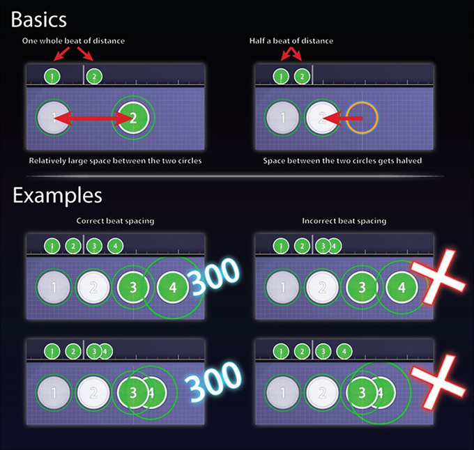

Distance Snap
===============

***Distance between consecutive circles will be snapped based on their rhythmical difference.***

The simplest way to ensure beat spacing is correct on your beatmaps is to utilize the editor's Distance Snapping function, found in the upper-right hand side of the editor. The relative distance between notes can be adjusted using 'Alt' and the mouse wheel. This enables one to ensure beats that are close together on the timeline are close together on the beatmap, and vice versa. This helps with intuitive play and good beat spacing. If you stick to using Distance Snap for the whole song, correct beat spacing is guaranteed!

When Distance Snap is turned on, each object can only be placed in a circle around the previous object. The radius of the circle is based on how much time has passed since the last object. The distance/time variable can be changed in the editor to make the circle smaller/larger. After a certain period of time (time needed), the snapping is turned off.

Edit's description
------------------

Distance between consecutive circles will be snapped based on their rhythmical difference.
Shortcut: Hold 'Alt' to temporarily toggle, or hit 'Y'.
'Alt' + Mousewheel adjusts snapping multiplier.
Snapping multiplier can also be changed by holding 'Alt' and dragging the slidebar at the top-right.

Why do I need to fix the distance?
----------------------------------

The basic rule of a good rhythm game difficulty is that the beat of the music should correlate to the hit-object position in the playing field. For example, an intensive rhythm means hit-objects should be located near to each other to facilitate the chaotic streaming like the song does; likewise, a slow-flowing rhythm means hit-objects should be placed just far enough to feel the song resonate with grace and timing. If the song has a part where the rhythm sounds consistent, the hit-objects should be spaced and paced equally.
Unlike most rhythm games which only have fixed interface and controls, osu! Standard provides a large drawing canvas for you to showcase your creativity to the music. Because the mapper has unrestricted use of the playfield, it can be daunting for new mappers to map a *sensible* difficulty without making it look awkward and unnatural (like end-of-screen jumps or shapes not suited to the rhythm).
To help new mappers unfamiliar with the unorthodox method of mapping, **Distance Snap** is invented to facilitate better mapping readability and playability to the rhythmical difference of the song. When Distance Snap is turned on, each object can only be placed in a circle around the previous object. The radius of the circle is based on how much time has passed since the last object. The distance/time variable can be changed in the editor to make the circle smaller/larger. After a certain period of time (time needed), the snapping is turned off automatically with a red marking; an error as the circle is out of the playfield. In addition, the spacings between the notes affects the speed multiplier of the sliders and current BPM timing section.
There are **three ways to enable/disable Distance Snap**:-

-   **Click** on the **"Distance Snap" icon at the lower-right of the screen**. It is enabled if it glows; click again to disable it.
-   Use keyboard's hotkey, `Y`, to enable/disable it.
-   **Hold** keyboard's key, `Alt`, to **temporary enable/disable** the disabled/enabled Distance Snap respectively **until you release** the key.
    -   While holding the `Alt` key, the Beat Snap Divisor slider located at the upper-right of the editor will switch to Distance Spacing slider, allowing you to set the multiplier for the distance/time variable by mousewheel or sliding it. Default is 1.0x from 0.1x - 6.0x.

**Note**: A red Distance Snap icon means the circle is too far away from the playfield, hence an error. You can fix it by lowering the distance spacing multiplier or use your own judgement and other mappers' opinions.

Suggested Distance Spacing multiplier?
--------------------------------------

When setting the distance, you should focus on certain points having about the same the BPM and use your own judgement. While it is possible to use up to 6.0x, a high and inconsistent use of the multiplier will make hit-objects look like they are randomly scattered on the field. As the lower limit may vary, try to make sure that hit-objects do not overlap with each other too closely except for special cases like (death)streams.

Using Distance Snap
-------------------

Distance Snap is just a **tool** to maintain proportional distance between two hit-objects, a "crutch" if you will. It works well in most situations but over-reliance will make your difficulty predictable and with limited working space. While it is not wrong to use Distance Snap, remember that it is just a tool intended to suit the mapper's purpose. A change in distance should make sense and follow to the rhythm well. Distance Snap is just a helper and does not constitute a professional advice, that would be in the [beatmap forum](/wiki/Beatmap_Forum) if you need one.
