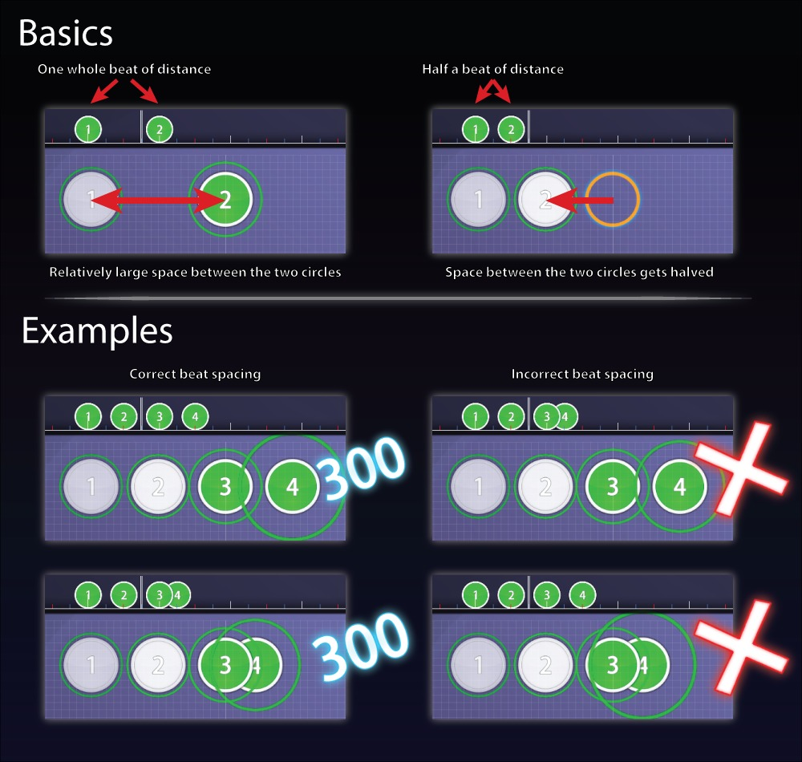

Espacement des notes
=====================

Le moyen le plus simple de s'assurer que le placement d'un battement sur l'une de vos beatmaps est correcte est d'utiliser la fonction d'alignement des distances, qui se trouve en haut à droite de l'éditeur. La distance relative entre les notes peut être ajusté avec la molette de la souris. Cella permet de s'assurer que les battements collent au mieux avec les notes programmées et vice-versa. Cela aide à un jeu intuitif et avec un battement bien espacé. Si vous utilisé l'alignement des distances pour tout une musique, un placement correct des battements est garanti !

Quand l'alignement des distances est enclenché, chaque objet peut seulement être placé dans un cercle avant le prochain objet. Le rayon de ce cercle est basé sur combien de temps est passé depuis le dernier objet. La variable distance/temps peut être changé dans l'éditeur pour rendre le cercle plus gros/petit. Après une certaine période de temps (un temps nécessaire) l'alignement est éteint.
