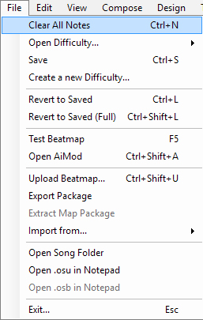
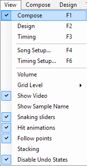
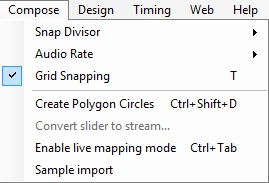

# Menu

## Fichier

**Commandes de base du fichier.**

### Commandes de fichiers

| Nom | Description |
| :-- | :-- |
| Supprimer tous les éléments (`Ctrl` + `N`) | Supprimer tous les éléments de la difficulté actuelle. |
| Ouvrir la difficulté... | **Pour l'édition :** Passez rapidement d'une difficulté à l'autre. **Pour référence :** (osu!mania seulement) Superposez la difficulté sélectionnée sur la difficulté (actuellement) ouverte. |
| Enregistrer (`Ctrl` + `S`) | Enregistrer les changements en cours (à la fois `.osu` et `.osb`) |
| Enregistrer en tant que nouvelle difficulté... | Enregistrez les changements actuels sur cette difficulté comme une nouvelle difficulté. L'ancienne difficulté est conservée dans son dernier état sauvegardé lors du rechargement. |

### Commandes de réversion

| Nom | Description |
| :-- | :-- |
| Annuler toutes les modifications (cette diff) (`Ctrl` + `L`) | Annuler toutes les modifications et recharger la beatmap telle qu'elle a été sauvegardée dernièrement (hitnotes). |
| Annuler toutes les modifications (beatmap)) (`Ctrl` + `Shift` + `L`) | Annuler toutes les modifications et recharger la beatmap telle qu'elle a été sauvegardée dernièrement (timing, storyboard). |

### Commandes de dépannage

| Nom | Description |
| :-- | :-- |
| Tester la beatmap... (F5) | Tester la beatmap. Les modifications en cours seront enregistrées afin de tester votre beatmap. |
| Ouvrir AiMod (`Ctrl` + `Shift` + `A`) | Ouvrir AiMod . |

### Beatmap Commandes d'empaquetage

| Nom | Description |
| :-- | :-- |
| Publier la beatmap... (`Ctrl` + `Shift` + `U`) | Publier votre beatmap sur la section [WIP](https://osu.ppy.sh/community/forums/10) du forum. Il est nécessaire d'être connecté au site d'osu! pour voir le forum "Beatmaps". |
| Exporter la beatmap.. | Exportez la beatmap en `.osz`. Le fichier sera envoyé dans le dossier "Exports" et vous serez dirigé vers osu!/Exports depuis l'éditeur de Beatmap. |
| Extraire le paquet de cartes | ? |
| Importer un fichier...| **bms/bme:** (osu!mania seulement) Ouvrez le fichier `.bms`/`.bme` pour l'importer en tant que difficulté osu!mania. |

### Commandes du programmeur

| Nom | Description |
| :-- | :-- |
| Ouvrir le dossier Songs | Ouvrez le dossier contenant les éléments de votre beatmap|
| Ouvrez `.osu` dans le Bloc-notes | Ouvrez le fichier de difficulté de beatmap dans MS Notepad. |
| Ouvrez `.osb` dans le Bloc-notes | Ouvrez le fichier de base (storyboard) dans MS Notepad. |

### Commande de sortie d'urgence

| Nom | Description |
| :-- | :-- |
| Quitter... (`Esc`) | Quitter l'éditeur de beatmaps. Une fenêtre peut parfois vous proposer de sauvegarder les derniers changements éffectués à votre beatmap.|

## Éditer

Éditer les commandes. Identique aux raccourcis MS par défaut.

### Commandes Rétablir/Annuler

Notez que ces commandes peuvent être désactivées à partir de la barre latérale [Options](/wiki/Options)  pour éviter les plantages lors de l'édition de chansons marathon.

| Nom | Description |
| :-- | :-- |
| Annuler (`Ctrl` + `Z`) | Annuler une étape. |
| Rétablir (`Ctrl` + `Y`) | Rétablir une étape annulée |

### Commandes d'édition (Sélectionnez une note avant de l'utiliser)

| Nom | Description |
| :-- | :-- |
| Couper (`Ctrl` + `X`) | Couper la/les note(s). |
| Copier (`Ctrl` + `C`) | Copier la/les note(s) |
| Coller (`Ctrl` + `V`) | Coller la/les note(s) |
| Supprimer (`Delete`) | Supprimer la/les note(s) |

### Commandes spéciales

| Nom | Description |
| :-- | :-- |
| Tout sélectionner (`Ctrl` + `A`) | Sélectionner toutes les notes. |
| Cloner (`Ctrl` + `D`) | Copier les éléments séléctionnés et les coller directement |

### Commandes de rotation

| Nom | Description |
| :-- | :-- |
| Inverser  (`Ctrl` + `G`) | **Slider :** Inverser le placement de la numérotation. **Sélectionner tout + ceci :** Votre conception de beatmap va dans l'autre sens. Exemple : Vous appliquez cette modification a un patern, le début se retrouvera à la fin et vice versa |
| Symétrie horizontale (`Ctrl` + `H`) | Renverser la ou les notes de gauche à droite (par rapport à la ligne de l'axe des y de l'origine du terrain de jeu) et vice versa. |
| Symétrie verticale (`Ctrl` + `J`) | Renverser la ou les notes de haut en bas (par rapport à la ligne de l'axe des x de l'origine du terrain de jeu) et vice versa. |
| Rotation de 90° horaire (`Ctrl` + `>`) | Faites pivoter la ou les notes de 90° vers la droite |
| Rotation de 90° antihoraire (`Ctrl` + `<`) | Faites pivoter la ou les notes de 90° vers la gauche |
| Rotation personnalissée... (`Ctrl` + `Shift` + `R`) | Réglez votre angle de rotation (+/- 180°) pour la ou les notes. Vous pouvez régler le sens de rotation [(Anti-/)Clockwise] et l'origine [(Playfield/Selection) Centre.] |
| Homothétie personnalissée... (`Ctrl` + `Shift` + `S`) | Définissez votre taille d'agrandissement (0.500x - 1.200x) pour la ou les notes. Vous pouvez ajuster l'origine [(Playfield/Selection) Centre] et " Appliquer à " (l'échelle d'agrandissement à) l'un ou l'autre ou les deux axes x et/ou y. |

### Boutons de réinitialisation

| Nom | Description |
| :-- | :-- |
| Réinitialiser les bruitages de la section | Supprimer le son des notes actuellement sélectionnées. |
| Réinitialiser les bruitages de tous les éléments| Supprimer tous les bruitages de toutes les notes de cette difficulté. |
| Réinitialiser les combo | Annuler l'ensemble des combo de la map. |
| Réinitialiser les pauses | Annuler les pauses. Ne fonctionne pas sur les temps de pause automatisés qui empêchent une vidange excessive de HP. |

### Commandes de poussée

| Nom | Description |
| :-- | :-- |
| Poussez vers l'arrière (`J`) | Déplacez la ou les notes d'un temps vers l'arrière dans la timeline en vous basant sur le diviseur de mesure |
| Poussez vers l'avant (`K`) | Déplacez la ou les notes d'un temps vers l'avant  dans la timeline en vous basant sur le diviseur de mesure |

## Affichage

Lieux d'intérêt.

### Commandes de tabulation

| Nom | Description |
| :-- | :-- |
| Compose (`F1`) | Aller vers l'onglet Compose |
| Design (`F2`) | Aller vers l'onglet Design |
| Timing (`F3`) | Aller vers l'onglet Timing |

### Commandes de configuration

| Nom | Description |
| :-- | :-- |
| Configuration de la beatmap... (`F4`) | Aller vers la fenêtre de configuration de la beatmap. |
| Configuration du timing... (`F6`) | Aller vers la fenêtre de configuration du timing. |

### Commandes spéciales

| Nom | Description |
| :-- | :-- |
| Volume | Ajuster les différents éléments audio (Musique / Effects). |
| Densité de la grille | Ajuster la taille de la grille. 1)/2/3/4 qui sont respectivement Grand/Moyen/Petit/Minuscule. |
| Afficher la vidéo | Afficher la vidéo dans l'éditeur. (Généralement désactivé parce que cette option est distrayante.) |
| Afficher le nom des bruitages | Voir le nom des bruitages attachés au note. Cette option est réservée au osu!mania. |
| Sliders progressifs | Animer les sliders comme si vous jouiez dans le jeu. |
| Animation des éléments comme dans le jeu | Animer les éléments comme si ils étaient cliqués dans le jeu. |
| Follow points | Afficher (et animer) les follow points comme dans le jeu. |
| Empilage | Empiler les cercles de frappe superposés comme dans le jeu (selon les réglages de difficulté) |
| Désactiver les états d'annulation | Abandonner la possibilité d'annuler pour osu! pour être plus rapide pendant l'édition (ceci est pratique pour les cartes de marathon long) |

## Compose

*Page principale : [Compose](/wiki/Beatmap_Editor/Compose)*

### Commandes des règles

| Nom | Description |
| :-- | :-- |
| Diviseur de mesure | [Beat Snap Divisor](/wiki/Beatmap_Editor/Beat_Snap_Divisor) |
| Vitesse de la musique | Permet de changer la vitesse de défilement de la musique (25%/50%/75%/100%) |
| Alignement auto des éléments sur la grille (T) | Permet d'aligner automatiquement les objects placés avec la grille |

### Commandes spéciales

| Nom | Description |
| :-- | :-- |
| Insérer des notes en cercle (`Ctrl` + `Shift` + `D`) | Créer un flux circulaire de cercles de frappe. Vous pouvez ajuster la Distance Snap (0.1x - 6.0x) {Espacement entre les notes}, l'Angle de décalage (0° - 180°) {Angle de rotation}, la Répétition et les Points (3 - 14/282) {Nombre de cercles}. |
| Convertir le slider en stream... | (Sélectionnez un slider) Convertir un slider en stream. Vous pouvez choisir entre deux options : Par le nombre d'objets ou Par la distance. **Par nombre d'objets:** Ajustez le flux du slider avec la quantité donnée de hit-circles (1 - 17/100). **Par distance snap:** Ajustez le flux du slider avec une distance donnée entre deux notes (0.10x - 5.00x). Peut résulter en une quantité absurde de cercles, puisque il repose sur le diviseur de mesure (un temps = une note). **Beat Snap Divisor:** Ajusteur de timing des notes. |
| Activez le live mapping (`Ctrl` + Tab) | osu!/osu!catch/osu!taiko maps : utilisez les touches osu!taiko pour ajouter des objets, tout en jouant la chanson dans l'éditeur. Ces objets via l'emplacement du curseur. Le bruitage des notes sera différent selon la touche osu!taiko sur laquelle vous avez appuyé. Cartes osu!mania : utilisez les touches osu!mania pour entrer des objets, pendant que vous jouez la chanson dans l'éditeur. Ces objets seront placés selon la touche que vous avez appuyée. Cette fonction ne fonctionne pas pour les sliders/hold. |
| Importer un bruitage | [Keysound and Sound Sampling.](/wiki/Beatmap_Editor/Compose) |

## Design

*Page principale : [Design](/wiki/Beatmap_Editor/Design)*

| Nom | Description |
| :-- | :-- |
| Déplacer tous les éléments du storyboard... | Déplacer *tout* par valeur #ms. Utile si vous avez changé le .mp3 ou l'offset. |

## Timing

*Page principale : [Timing](/wiki/Beatmap_Editor/Timing)*

### Commandes du métronome

| Nom | Description |
| :-- | :-- |
| Rythme | Ternaire (3/4) ou binaire (4/4). Pour un timing plus approfondi, utilisez la fonction Timing Setup Panel. |
| Métronome | Activer/Désactiver le son "tic, tic , (tic) , toc" du métronome

### Commandes des marqueurs

| Nom | Description |
| :-- | :-- |
| Ajouter une section temporelle (`Ctrl` + `P`) | Ajouter un décalage rouge (Nouveau BPM) |
| Ajouter une section héritée (`Ctrl` + `Shift` + `P`) | Ajouter un décalage vert (nouvel ajusteur) |
| Réinitialiser la section actuelle | Réinitialiser la section temporelle actuelle|
| Supprimer la section de chronométrage (`Ctrl` + `I`) | Supprimer la section temporelle/héritée actuelle|
| Repositionner les éléments de la section actuelle | Ajuster les éléments de la section actuelle pour qu'ils soient sur une mesure |

### Configuration du chronométrage

| Nom | Description |
| :-- | :-- |
| Configuration du timing... (F6) | [Timing Setup.](/wiki/Beatmap_Editor/Timing) |

### Commandes spéciales

| Nom | Description |
| :-- | :-- |
| Repositionner tous les éléments | Ajuster tous les éléments de la beatmap pour qu'ils soient sur une mesures |
| Déplacer tous les éléments de... | Déplacer toutes les notes par #ms |
| Recalculer la longueur des sliders | Laissez osu! recalculer la longueur des sliders. (Il est préférable de l'utiliser si bpm/vitesse du curseur/multiplicateur de vitesse du curseur a changé.) **Attention :** Faire cela peut raccourcir la longueur de vos sliders ! Vérifiez votre carte après utilisation ! |
| Supprimer toutes les sections temporelles | Purger les sections temporelles. |

### Commande de prévisualisation

| Nom | Description |
| :-- | :-- |
| Définir le point de prévisualisation à la position | Définir cet horodatage comme marque jaune (extrait de démo pour la sélection de morceaux). |

## Web

Ouvre votre navigateur. Vous envoie principalement sur le fil de discussion de la beatmap (nécessite une connexion au site).

| Nom | Description |
| :-- | :-- |
| Page web de la beatmap | Aller à la page d'information de cette beatmap. Le lien est `https://osu.ppy.sh/beatmaps/###` où "###" est l'ID de la beatmap. |
| Topic de la beatmap | Aller à ce fil de discussion de Beatmap. |
| Réponse rapide | Postez une réponse au fil de discussion beatmap. |

## Aide

| Nom | Description |
| :-- | :-- |
| Afficher l'aide (menu compose)| Ouvre la référence de l'aide en jeu. |
| Voir la FAQ | Lien vers [Beatmapping](/wiki/Beatmapping). |
