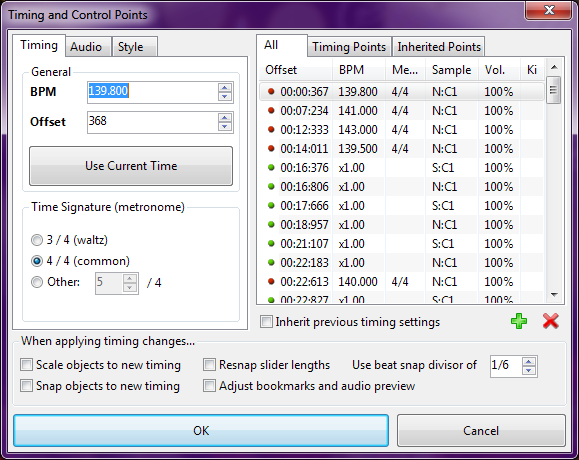

Timing (Français)
===================

Le **timing** d'une [Beatmap](/wiki/Beatmaps) se compose de la définition du décalage du son (« *offset* ») et du nombre de battements par minute (BPM). Le BPM de la musique va en général aussi vite que le son lui-même. Le décalage correspond à la durée entre le nombre de temps entre le début du mp3 et le premier battement du son, c'est-à-dire le début de la musique.

Le fait d'avoir un timing correct permet d'avoir la ligne de timing dans l'[éditeur](/wiki/Beatmap_Editor) aligné avec la musique. Si le timing est incorrect, la ligne de timing ne correspondra pas avec le son. Ainsi, vous ne pourrez pas placer avec précision les objets et il deviendra impossible de mapper correctement la musique.

Trouver le bon timing
---------------------

Sections de timing
------------------

Les sections de timing (« *timing sections* ») vous permet de varier le timing tout le long de la musique. Il existe deux types de sections de timing : les sections ordinaires et les sections héritées.

Les sections de timing ordinaires sont représentées par des lignes rouges dans l'éditeur. Chaque map en a au moins une. Quelques maps changent leur BPM pendant le son, cependant elles ont malgré tout besoin d'avoir plusieurs sections ordinaires.

Les sections de timing héritées sont représentées par des lignes vertes dans l'éditeur. Elles ne changent pas en réalité le timing du son. Le but des sections héritées est de vous laisser changer le volume des [Hitsounds](/wiki/Glossary) de la map, les hitsounds eux-mêmes, la vitesse des [sliders](/wiki/Beatmap_Editor/Slider) ainsi que d'autres paramètres sans avoir à modifier le timing de la musique (ce qui se produirait avec une section ordinaire).

Ces deux types de sections sont souvent appelés respectivement « décalage rouge » et « décalage vert » (*red offsets* et *green offsets*).
