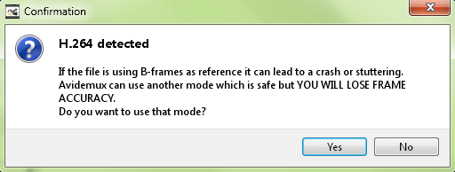
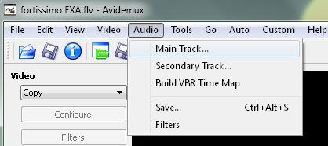
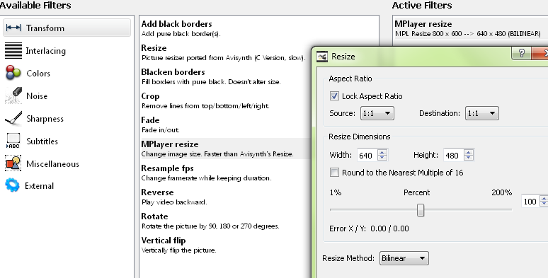
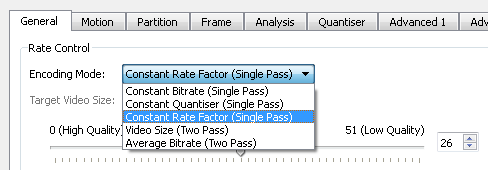

Compressing Videos
=====================

[*How to re-encode/edit a video* by: ziin](https://osu.ppy.sh/forum/t/58235)

Precursor/Notes
---------------

Editing videos with [avidemux](http://fixounet.free.fr/avidemux/download.html)

Removing audio
--------------

1) Open avidemux

2) Drag and drop the file into avidemux

3) If the following shows up because the video is h.264 (h.264 is the best right now):

   a) Press either (no is better unless the program crashes).

4) Select Audio -> Main Track

5) Select Audio Source -> None

Encoding Video
--------------

6) Make sure that both the video and audio are on "Copy".

7) If you want to instead re-encode the file, then choose "MPEG-4 AVC" to pick h.264. Note that…

*mm201 wrote:* h.264 lags single-core machines like crazy and shouldn't be used. I do not agree with this, as we have a video toggle, and this isn't 2005. If you want to support ancient PCs, then use h.263 or Xvid.

8) To resize the image, click on "filters" and "MPlayer resize" then input how much you want to resize. Most of the time you should keep this at 800x600 or 853x480 (though I use 800x450 for widescreen).

9) To actually reduce the filesize of the video, there are a few options, all of which are in the "configure" menu

10) The correct way is to use a constant rate factor (usually between 30-36) since single pass encodes are of higher quality. You can also use a 2 pass encode which will set the video size (I suggest ~7 MB) or Average bitrate (I suggest 400-800 kbps). Avidemux doesn't like saving h.264 flv files, but works fine with avi files. Since osu plays both just fine (and avi is slightly smaller than flv), save the file as an avi.

Save
----

11) Press `Ctrl` + `S` to save the file somewhere, then copy it into your folder.

Final Remarks
-------------

If avidemux does not open your file correctly, there are alternatives: [Mediacoder](http://www.mediacoderhq.com/) is a bit more difficult to use, but might work, and can save h.264 flv files. [SUPER](http://www.erightsoft.com/SUPER.html) isn't very good, hard to find, but is another program that might be worthwhile, if you can find the download on the website. Finally, [VLC](http://www.videolan.org/vlc/) can be used, **but that should be avoided at all costs**.

The reason I like avidemux is because you can easily edit each frame, and it has a good interface, unlike mediacoder (which has greater compatibility). I've never been able to get virtualdub to work properly.
