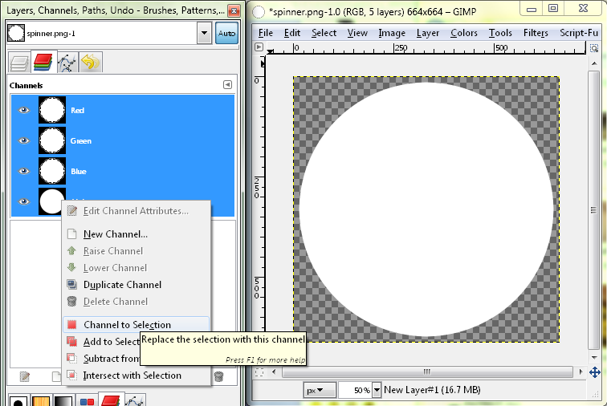
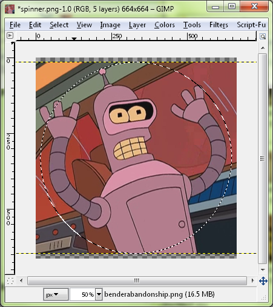
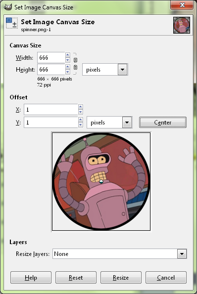
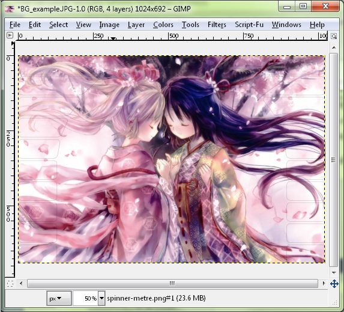

[*How to make spinners symmetrical* by: ziin](https://osu.ppy.sh/forum/t/51502)

This guide is probably hard to understand for people with little experience with gimp/photoshop. This guide assumes you know how to (and are able to) turn on/off layers, as well as find some things on your own. If you have questions, you can forum PM and I'll try to help. I'm no good at actually generating content, though, just editing someone else's work.

How to make symmetrical spinners
--------------------------------

I'm tired of seeing wobbly spinners. Please, if you want to make a spinner, make sure it's perfectly centered.

First open up your image editor, I use [GIMP](http://www.gimp.org/), since it's free.

Make a new document. The template skin is 666x666, and while it's safe to go over that limit, **spinners can cause lots of lag on slow computers, so it's best to make it under that limit**. Make the document 664x664, so that when we are done, we can pad the edges with transparency, which lets osu! know that it can anti-alias the border, rather than make it a straight edge.

### Make a new document

### Select your circle

Use the ellipse tool (shortcut is "e") and make a circle on the entire document. Create a new layer and fill it with a color.

### Shrink the selection

Then shrink the selection by going to Select -&gt; Shrink. Fore more accurate circles, simply redraw them with the ellipse tool, as "shrink" is only good for one or two circles.

I chose 15, but you can choose however much you want. Create a new layer and fill the smaller selection with a different color so you can see it.

### The spinner

Repeat the process for the center dot as well, or any other circles you want. I chose 300.

### Adding an image to the spinner

You can then use each layer to make designs, or put your picture on it by selecting the alpha channel of that layer

### Copying the image

And copy/paste the selection from the image you want to copy:

### Set canvas size

Finally, you can add a design in the middle, or recolor the edges. Make sure you reset the canvas size to 666x666 by going to Image -&gt; Canvas Size, and center the image so you have a 1 pixel border around the image.

Now you should have a perfect spinner which doesn't wobble when you spin it.

I won't tell you how to make the edges pretty, or give it depth, that's something entirely different. I chose a very simple image and process. If you want to do that, there are guides everywhere, or you probably already know how to do that. However it seems that symmetry has escaped most of the people who make skins.

How to make spinner backgrounds which match the beatmap background
------------------------------------------------------------------

If you want your spinner to have the same background as the actual map, it can be difficult because of a bug in osu! introduced by a gameplay change which was never fixed. First, we need to match up the background *in the game* and not *in the beatmap editor*. The beatmap puts storyboarded elements (background and video) 5 pixels higher on 1024x768 than the rest of the map.

### Don't worry if the spinner looks wrong in the editor

### Cropping the background

First, take the background at 1024x768 and crop out the top 46 pixels and bottom 30 pixels, giving you a 1024x692 image. The template image is 1023x692, but this doesn't matter; the right side is just pure black due to the nature of how spinners work.

### Use the channels tab to turn off editing the alpha channel

Technically, you are done, but if you want to make the background "fill in" with a background spinner meter, then you can use the template skin, or make it yourself. Bring in the template spinner-meter. To recolor it, turn off the alpha channel by selecting it, so you don't modify the transparency at all. Then use the bucket fill and fill the entire area with a gray color or whatever color you want (I used black).

### Copy/Paste into new layer, then save your spinner meter

Once you have the color, select the entire alpha channel again (right click on the alpha channel -&gt; channel to selection) copy and paste the spinner background so you have something to fill in for your spinner meter.

### Turn down the opacity until you get a color your like

To add some more detail, you can turn down the opacity on the black image.

### The fully spun spinner background and meter

Then you can see how it looks filled in by turning on the old layer. Note it has a little bit of an outline. If you want to change the size of that outline, you can use the select - grow or shrink tool before you copy/paste to make the spinner meter.

If you do this, the transition from background to spinner will be seamless, and you won't have the background move up a few pixels.
