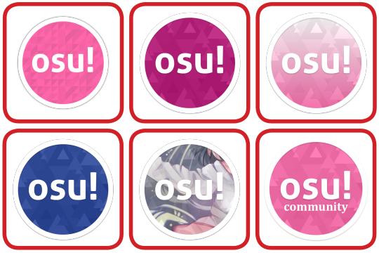

# Directives d'identité de marque

Les directives d'identité de marque sont un ensemble de normes pour les projets liés à osu! Toute utilisation ne nécessite pas d'approbation.

[Téléchargez le kit de conception ici.](https://drive.google.com/file/d/1TmUot5nu49p71icz4u3G68njLAQOeQrG/view?usp=sharing) Le kit de conception lié contient quelques actifs périmés. Notez également que le PDF inclus est obsolète et que cette page doit être utilisée à la place.

## Logo d'osu! en forme de cookie

### Restrictions d'utilisation des cookies

#### Couleur unique

C'est la version unicolore du logo en forme de cookie d'osu! Cette version du logo est très polyvalente et peut-être adaptée à de nombreux styles de design.

Veuillez utiliser le fichier original comme base, et ne pas créer le logo à partir de zéro.

#### Couleur

Voici la version couleur du logo en forme de cookie d'osu! L'ombre portée subtile fait partie du logo en couleur.

Veuillez utiliser le logo tel que fourni par le kit de conception sans aucune modification.

### Zone d'espace libre

S'il vous plaît, laissez le cookie respirer un peu. Utilisez le "o" d'"osu!" comme mesure de l'espace.

### Restrictions d'utilisation des cookies d'une seule couleur

Puisque osu! est un projet communautaire, le logo en forme de cookie  d'osu! est conçu pour être simple et polyvalent ; il peut s'adapter facilement à de nombreux designs. Il n'y a aucune restriction stricte quant à la couleur du cookie.

-   Le cookie doit être tranchant tout le temps.
-   Vous pouvez utiliser n'importe quelle couleur pour le cookie.
-   Vous pouvez ajouter un dégradé linéaire au cookie. Les dégradés radiaux ne sont pas recommandés car l'anneau et l'élément central peuvent apparaître dans des couleurs complètement différentes.
-   Vous pouvez masquer une œuvre d'art comme texture pour le cookie; toutefois, le cookie doit avoir un bon contraste avec l'arrière-plan.

* * *

-   **Ne pas changer** le ratio d'aspect du cookie.
-   **Ne pas faire** tourner le cookie. Le cookie doit s'aligner sur l'orientation du support ou sur l'œil du lecteur lors de la lecture.
-   **Ne pas changer** un élément du cookie en quelque chose d'autre.
-   **Ne pas enlever** un élément du cookie.
-   **Ne pas redimensionner** un élément du cookie de façon indépendante.
-   **Ne pas modifier** un élément du cookie
-   **Ne réorganisez pas** les éléments du cookie.
-   Le cookie doit toujours avoir du tact. S'il fait partie d'une œuvre d'art, veuillez placer un autre logo bien aiguisé quelque part dans l'œuvre d'art.
-   **Ne pas appliquer** pas d'effets de fantaisie (ou vraiment collants) sur le cookie.
-   **Ne pas placer** d'éléments supplémentaires à l'intérieur du cookie.
-   **Ne pas appliquer** de contours sur le cookie. Utilisez une couleur de cookie différente.
-   **Ne pas penser**  à changer l'élément. Allez. Ce n'est même pas notre logo. C'est juste un texte dans un cercle.

### Restrictions d'utilisation des cookies couleur

Comme osu ! est un projet communautaire, le logo du cookie osu! est conçu pour être simple et polyvalent ; il peut s'adapter facilement à de nombreux designs. Veuillez utiliser le logo tel qu'il est, sans aucune modification. Toutes les restrictions appliquées sur le cookie unicolore s'appliquent également au cookie en couleur.

-   **Ne pas utiliser** l'ancien cookie.
-   **Ne pas utiliser** une autre teinte de rose.
-   **Ne pas ajouter** de dégradé de couleur au cookie.
-   **Ne pas utiliser** d'autres couleurs.
-   **Ne rien ajouter** dans le cookie.
-   **Ne pas changer** un élément du cookie en quelque chose d'autre.
