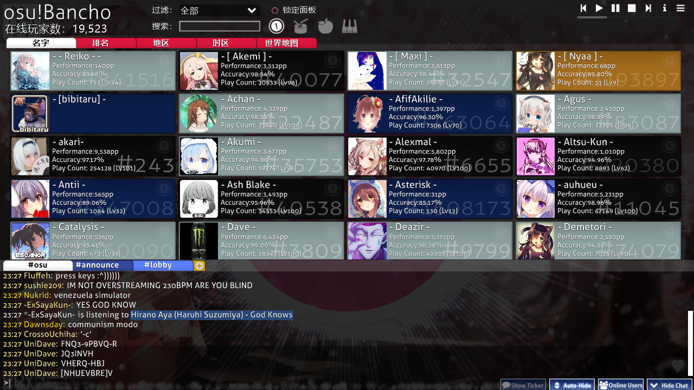
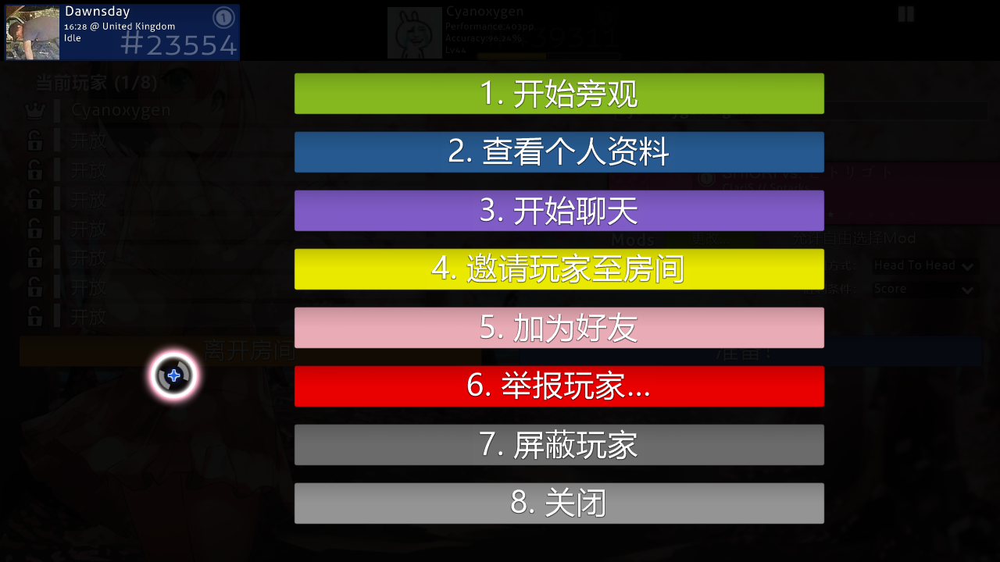

# 聊天面板

在 osu! 的绝大多数界面中，你都可以按下 `F8` 或者点击屏幕右下角的 `Show Chat` 按钮来把聊天面板叠加在屏幕的下方。

-   所有当前加入的频道均会在这一排选项卡中显示。仅需在某个选项卡上点一下，就能切换到你想聊天的那个频道。点击 `New` 将显示一个列表，包含所有可加入的频道。
-   不同颜色的用户名代表不同的含义，详情见表：

| 颜色 | 用户类型 |
| --- | --- |
| **白色** | 你自己 |
| **淡黄色** | 非 supporter 玩家 |
| **黄色** | [osu!supporter](/wiki/osu!supporter/ "osu!supporter") 玩家 |
| **红色** | [社区管理团队](/wiki/People/Global_Moderation_Team/ "社区管理团队") 或 [质量保障团队](/wiki/People/Quality_Assurance_Team/ "质量保障团队") 的成员 |
| **绿色**   | 如果一行消息中出现你的用户名或者或者某个你添加的可触发高亮标记的关键字词，你的用户名就会被绿色的高亮标记。该高亮消息的副本也会以出现在 `#highlight` 频道的形式单独发送给你。 |
| **蓝色** | 私信你的玩家 |
| **蓝绿色** | osu! 的创造者 [peppy](https://osu.ppy.sh/u/2 "peppy") |
| **粉色** | [BanchoBot](/wiki/BanchoBot/ "BanchoBot") 机器人 |

-   点击 `Show Ticker` 按钮将在聊天面板不可见的情况下，在屏幕最底部一行显示当前频道里最新的消息 ；
-   点击 `Auto-Hide` 按钮将在游戏时自动隐藏聊天面板 （除谱面的前奏、休息时段和结尾外）；
-   点击 `Hide Chat` 按钮或者按下 `F8` 可以隐藏聊天面板。

##  扩展聊天面板

*[osu! 学院](/wiki/Announcements/osu!academy/ "osu! 学院")  [第 6 集 (6:52)](https://www.youtube.com/watch?v=cyYRl-a5xII "该视频为英文。点击前往 YouTube") 介绍了该节和  [多人游戏](/wiki/Multi/ "多人游戏") 的内容 。*

你可以在 osu! 的绝大多数界面中按下 `F9` 或者在主屏幕按下屏幕右下角的 `Online users` 以打开扩展聊天面板。与聊天界面不同的是，在线玩家面板占用了屏幕的三分之二，展示着 osu! 目前在线玩家的一些信息。

每一个当前已经登录 osu! 的玩家都会在扩展聊天面板中以小卡片的形式出现。 它会默认展示该玩家的基本信息（用户名、 Ranked 谱面总分、排名、准确度、游玩次数以及该玩家的头像，如果有）。当鼠标指针处在这个方块上的时候，它就会显示另外一些信息（用户名、排名、头像、当地时间、时区、所在国家；如果玩家同意的话，还可以显示具体位置以及玩家正在做什么）。

-   “ 好友 ” 分类下仅会展示你的在线好友玩家；
-   锁定面板可以防止面板上的玩家们跳来跳去，也可以阻止显示新登录的玩家出现在面板中；
-   点击某个标签页可以将所有登录的玩家按相应的分类或顺序排列；
-   点击 “ 世界地图 ” 将会展示一幅标示玩家登录位置的地图；
-   你可以拖拽右侧的滚动条，或者使用鼠标滚轮来滚动屏幕；
-   如果某个玩家的方格里没有显示任何的信息，那么该玩家就在 IRC 客户端上登录聊天。

| 卡片颜色 | 注释 |
| --- | --- |
|  | 深蓝色 - 玩家正在空闲中或者玩家正在聊天。 |
|  | 灰色 - 玩家正在单人游戏中。 |
|  | 靛蓝色 - 玩家正在观看回放或正在旁观他人。 |
|  | 红色 - 该玩家正在编辑他本地的谱面。 |
|  | 紫色 - 玩家正在测试他自己的谱面。 |
|  | 蓝绿色 - 正在提交（或上传 / 更新）他们所制作的谱面。 |
|  | 绿色 - 正在观摩别人的谱面，提出修改建议。 |
|  | 棕色 - 玩家在多人游戏房间中，但未开始游戏。 |
|  | 黄色 - 玩家正在进行多人游戏。 |
|  | 黑色 - 玩家目前不活跃或者离开了电脑 （ AFK ）。 |
|  | 深蓝色，没有任何内容 - 玩家并未登录游戏但登录了 IRC 客户端聊天；或者该玩家的状态目前不可用。 |

点击一个玩家，屏幕将显示一些选项，如图所示。

按下对应的数字按键或者点击即可激活该功能：

1.  `开始旁观`：当该玩家正在游戏、并且你有其所玩的谱面时，你可以在玩家游戏时旁观。你的名字将出现在该玩家的旁观者列表中。
2.  `查看个人资料`：在浏览器中打开该玩家的个人资料页面。
3.  `开始聊天`：打开一个和该玩家私聊的窗口。
4.  `邀请玩家至房间`：（ 仅在多人游戏房间中可用 ）将该玩家邀请到你的房间。
5.  `添加 / 删除好友`：添加该好友到你的好友列表，或者将其从中删除。
6.  `举报玩家`：举报玩家不正当的行为。也可以在论坛中举报玩家。
7.  `屏蔽玩家`：该玩家的所有聊天记录都将不再显示在你的聊天窗口中。
8.  `关闭`：关闭当前屏幕。

## 命令列表

### 帮助

| 命令 | 作用 | 示例 | BanchoBot 的回复 | 
| --- | --- | --- | --- |
| `/addfriend [玩家]` | 将 `[玩家]` 添加到你的好友列表。 | `/addfriend Amigo` | You are now friends with Amigo. *你和 Amigo 现在是好友了。* |
| `/delfriend [玩家]` | 将 `[玩家]` 从好友列表中移除。 | `/delfriend Amigo` | You are no longer friends with Amigo. *你和 Amigo 已不再是好友。* |
| `/away [消息]` | 设置离开消息（将回复至私信你的玩家）。将消息留空以取消离开状态。 | `/away I am John Smith.` | `You have been marked as being away: I am John Smith.` 当 Amigo 在与 John 聊天的窗口中输入 `/msg John Where are you~?` BanchoBot 将回答： `I am John Smith`. |
| `/bb` | 给 Bancho 发送消息。如： rank `[number]` | `/bb rank 1` | [15/11/12] Stats for Uan: Score: 47,323,299,680 (#1) Plays: 176293 (lv102) Accuracy: 98.95% |
| `/chat [玩家]` | 打开与该玩家的聊天窗口。 | `/chat Amigo` | （与 Amigo 聊天的窗口打开） | 
| `/clear` | 清除当前聊天窗口的全部内容。 | `/clear` | （ 当前窗口下的所有内容均被清除 ） | 
| `/ignore [玩家][@chp]` | 在本次登录中忽略特定玩家的所有消息。在后面加上 @ 和 ` c, h, p ` 中的任意字母，你可以分别从聊天、提及你的消息和私信中屏蔽该玩家。 | `/ignore Amigo@chp` | BanchoBot: You will no longer hear Amigo {chat} {highlights} {PM} （你的聊天界面被设为：`c` 屏蔽 Amigo 发送的任何消息；`h` 屏蔽 Amigo 发送的任何提及你名字的消息；`p` 屏蔽 Amigo 给你发送的任何私信) | 
| `/j [频道]` or `/join [channel]` | 加入指定的频道。 | `/join #lobby` | （ #lobby 频道的窗口出现 ） | 
| `/p` or `/part` | 离开当前加入的频道。 | `/part` | （ 当前频道的窗口关闭 ） | 
| `/unignore [玩家]` | 取消屏蔽在此次登录时所屏蔽的玩家。 | `/unignore Amigo` | You may now hear Amigo. （ 你的聊天窗口将重新显示 Amigo 所发的消息 ） | 
| `/me [动作]` | 以第三人称发送消息。 | `/me is at home` | * John is at home | 
| `/msg [玩家] [消息文字]` | 给 `[玩家]` 发送私信。 | `/msg Amigo I am sick at home.` | （ 在 Amigo 的聊天窗口中 ） John: I am sick at home. | 
| `/np` | 发送你正在听的 / 玩的歌曲。 | `/np` | （ 游戏时 ） * John is playing [Peter Lambert - osu! tutorial\[Gameplay Basics\]](https://osu.ppy.sh/b/22538) [Game Modes](/wiki/FAQ#alternative-game-modes) \~[Relax/Autopilot](/wiki/Game_Modifiers#special-mods)\~ +[Difficulty increasing mod](/wiki/Game_Modifiers#difficulty-increasing-mods) -[Difficulty decreasing mod](/wiki/Game_Modifiers#difficulty-reduction-mods)/[SpunOut](/wiki/Game_Modifiers#spun-out) [xK](/wiki/Game_Modifiers#xk) （不做任何事情时，取决于玩家卡片显示的状态 ） * John is listening to [Peter Lambert - osu! tutorial](https://osu.ppy.sh/b/22538) （ 旁观或使用 Auto 机器人时 ） * John is watching [Peter Lambert - osu! tutorial\[Gameplay basics\]](https://osu.ppy.sh/b/22538) [Game Modes](/wiki/FAQ#alternative-game-modes) \~[Relax/Autopilot](/wiki/Game_Modifiers#special-mods)\~ +[Difficulty increasing mod](/wiki/Game_Modifiers#difficulty-increasing-mods) -[Difficulty decreasing mod](/wiki/Game_Modifiers#difficulty-reduction-mods)/[SpunOut](/wiki/Game_Modifiers#spun-out) [xK](/wiki/Game_Modifiers#xk) [Autoplay](/wiki/Game_Modifiers#auto) |
| `/reply` or `/r` | 回复最后一个发送的私信。 | `/r Do you know any good doctor?` | （ 在 Amigo 的聊天窗口中 ） [Previous comments] John: I am sick at home. Amigo: Really? John: Do you know any good doctor? | 
| `/savelog` | 将当前窗口中的聊天记录存储为文件。 | `/savelog` | （ 在 osu! 目录下将创建一个名为 Chat 的文件夹，里面包含在该聊天窗口下的所有聊天记录 ） | 
| `/watch [玩家]` | 开始旁观 `[玩家]`。 | `/watch Amigo` | * Started spectating Amigo. （ 当 Amigo 玩你也拥有的谱面时，经过一段时间的缓冲之后你将可以旁观。Amigo 的屏幕左边也会出现你的名字。） | 
| `/nopm` | 设置允许所有人的私信，或仅允许好友的私信。 | `/nopm` | （ 屏幕将弹出一个横幅，显示你允许来自所有人的还是仅好友的私信 ） | 
| `/invite [玩家]` | 给 `[玩家]` 发送一个链接以将其邀请到你所在的房间。 | `/invite Nathanael` | * Nathanael has been invited to the game. *Nathanael 已被邀请至你所在的房间。* | 

### 按键功能

| 键盘按键 | 作用 |
| --- | --- |
| `Page Up` / `Page Down` | 滚动聊天窗口里的文字。你也可以使用鼠标滚轮来滚动。 |
| `Tab` | 自动补全你要输入的用户名。 |
| `F8` | 打开 / 关闭聊天面板。 |
| `F9` | 打开 / 关闭在线玩家面板。 |
| `Ctrl` + `C` / `V` | 复制 / 粘贴。 |
| `Alt` + `0` - `9` | 切换到对应数字的标签。 |
