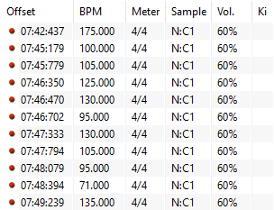
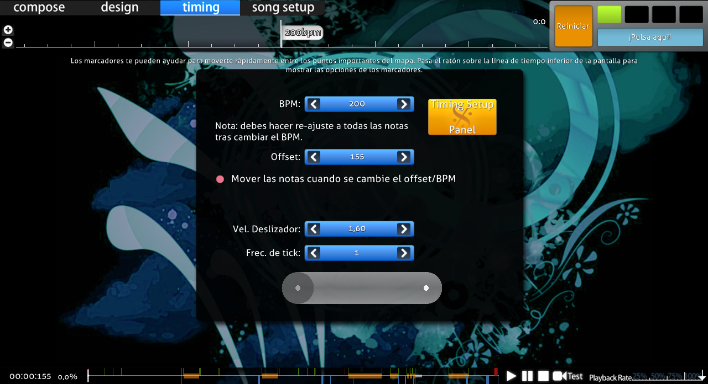

---
tags:
  - red line
  - red offset
  - red timing point
  - uninherited offset
  - green line
  - green offset
  - green timing point
  - inherited offset
  - timing setup
  - copy timing
  - paste timing
  - línea roja
  - offset rojo
  - punto de tiempo rojo
  - offset no heredado
  - línea verde
  - offset verde
  - punto de tiempo verde
  - offset heredado
  - configuración de temporización
  - copiar temporización
  - pegar temporización
---

# Pestaña timing

*Para obtener una guía de temporización, véase: [Cómo temporizar canciones](/wiki/Guides/How_to_time_songs)*\
*Véase también: [Beatmapping/Temporización](/wiki/Beatmapping/Timing)*

**Timing** es la pestaña del [editor de beatmaps](/wiki/Client/Beatmap_editor) para cambiar y configurar la temporización de un [beatmap](/wiki/Beatmap), la cual es esencial para la representación correcta de la canción. Contiene configuraciones y herramientas relacionadas con la temporización, y también una [ventana dedicada](#panel-de-configuración-de-la-temporización) para trabajar con múltiples [puntos de tiempo](#puntos-de-tiempo), tanto para la representación de estructuras musicales como para el diseño de beatmaps.

## Puntos de tiempo

*Véase también: [Offset](/wiki/Offset)*

En el [mapping](/wiki/Beatmapping), un *punto de tiempo*, coloquialmente llamado *offset*, es una forma de aplicar configuraciones comunes, como [temporización](/wiki/Beatmapping/Timing), multiplicadores de la [velocidad del slider](/wiki/Gameplay/Hit_object/Slider/Slider_velocity), o [hitsounds](/wiki/Beatmapping/Hitsound) y sus respectivos volúmenes, a una sección específica de un beatmap. En osu!, hay dos tipos de puntos de tiempo.

### Puntos de tiempo no heredados

::: Infobox

:::

Un punto de tiempo **no heredado** tiene su propia configuración de temporización. Varios de estos puntos se usan para representar cambios de tiempo en la canción, como el [tempo](/wiki/Music_theory/Tempo), irregularidades de ritmo o diferentes [signaturas de compás](/wiki/Music_theory/Time_signature). Agregar un nuevo punto de tiempo no heredado reinicia el metrónomo, lo que hace que cuente los pulsos a partir del offset del punto de tiempo, especificado en milisegundos.

Además de eso, los puntos de tiempo no heredados se pueden usar para omitir líneas de compás en [osu!taiko](/wiki/Game_mode/osu!taiko) o [osu!mania](/wiki/Game_mode/osu!mania).

Los puntos de tiempo no heredados tienen un color rojo en la línea de tiempo inferior y en el [panel de configuración de la temporización](#panel-de-configuración-de-la-temporización). Debido a esto, a menudo se les llama «offsets rojos» o «líneas rojas».

### Puntos de tiempo heredados

::: Infobox

:::

Un punto de tiempo **heredado** usa la configuración de temporización actualmente activa, *heredándola* del punto de tiempo anterior. Los puntos de tiempo heredados se utilizan para los siguientes propósitos:

- Cambiar la [velocidad del slider](/wiki/Gameplay/Hit_object/Slider/Slider_velocity)
- Controlar el volumen de los [hitsounds](/wiki/Beatmapping/Hitsound)
- Cambiar entre los [conjuntos de muestras](/wiki/Beatmapping/Sampleset) activos de los hitsounds
- Activar o desactivar el [kiai time](/wiki/Gameplay/Kiai_time)

Los puntos de tiempo heredados tienen un color verde en la línea de tiempo inferior y en el [panel de configuración de la temporización](#panel-de-configuración-de-la-temporización). Debido a esto, a menudo se les llama «offsets verdes» o «líneas verdes».

## Vista principal

La pestaña de temporización se puede abrir presionando `F3` y proporciona acceso rápido a las siguientes configuraciones:

| Nombre | Significado |
| :-- | :-- |
| `BPM` | [Tempo](/wiki/Music_theory/Tempo) del punto de tiempo actual, medido en pulsos por minuto (BPM). |
| `Offset` | [Offset](/wiki/Offset#mapping) del punto de tiempo actual, medido en milisegundos. |
| `Mover las notas cuando se cambie el offset/BPM` | Mantén los objetos adjuntos a las marcas de la [línea de tiempo](/wiki/Client/Beatmap_editor/Timelines) durante los cambios de tiempo |
| `Vel. Deslizador` | [Velocidad base del slider](/wiki/Gameplay/Hit_object/Slider/Slider_velocity) de todo el beatmap |
| `Frec. de tick` | Cuántas [marcas del slider](/wiki/Gameplay/Hit_object/Slider/Slider_tick) habrá en un [pulso](/wiki/Music_theory/Beat) |

Para realizar cambios mayores o menores rápidamente, utiliza los siguientes modificadores:

|  | Tempo | Offset | Velocidad del slider |
| :-- | :-: | :-: | :-: |
| `Ctrl` + clic | 0.25 BPM | 1 ms | 1 [osu! pixel](/wiki/Client/Beatmap_editor/osu!_pixel) |
| Por defecto | 1 BPM | 2 ms | 10 osu! pixels |
| `Shift` + clic | 5 BPM | 10 ms | - |

### Metrónomo

El metrónomo, que se encuentra en la esquina superior derecha de la pestaña timing, ayuda a encontrar rápidamente configuraciones de temporización aproximadas. Los BPM iniciales y los valores del offset de la canción se pueden encontrar tocando repetidamente `T` o haciendo clic en el botón `¡Pulsa aquí!` al ritmo de la canción.

La parte visual del metrónomo está adaptada a la [signatura de compás](/wiki/Music_theory/Time_signature) más común, 4/4. La primera sección denota el [tiempo fuerte](/wiki/Music_theory/Downbeat) y parpadea en verde, mientras que las secciones restantes parpadean en blanco en cada pulso de los [compases](/wiki/Music_theory/Measure) de la canción. Las signaturas poco comunes, como 7/4, añaden destellos adicionales, pero el tamaño del metrónomo no cambia.

## Panel de configuración de la temporización

El panel de configuración de la temporización, también llamado `Timing and Control Points`, es una ventana emergente que se puede abrir presionando `F6`. Contiene varias pestañas para trabajar con diferentes opciones de puntos de tiempo, como temporización, [hitsounds](/wiki/Beatmapping/Hitsound), volúmenes, [conjuntos de muestras](/wiki/Beatmapping/Sampleset) o efectos especiales.

### Seleccionar y compartir

Todos los cambios en el panel de temporización solo se aplican a los puntos de tiempo seleccionados.

- Para seleccionar múltiples puntos de tiempo arbitrarios, mantén presionada la tecla `Ctrl` mientras haces clic en ellos
- Para seleccionar varios puntos de tiempo seguidos, haz clic en el primero y luego haz clic en el último mientras mantienes presionada la tecla `Shift`
- Para **copiar o pegar puntos de tiempo desde y hacia el panel de temporización**, usa los atajos predeterminados de tu sistema operativo, como `Ctrl` + `C` y `Ctrl` + `V`
