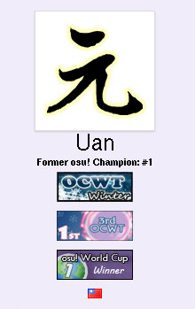

---
tags:
  - badges
  - profile badges
  - user badge
  - user badges
  - badges de profil
  - badge d'utilisateur
  - badges d'utilisateur
---

# Badge de profil

*À ne pas confondre avec les badges de groupe, qui apparaissent aussi sur le profil de l'utilisateur.*\
*Pour les règles concernant l'utilisation de badges en guise de récompenses de tournois, voir : [Support officiel aux tournois § Badges de profil](/wiki/Tournaments/Official_support#badges-de-profil)*

Les **badges de profil** (communément appelés *badges*) sont de petits éléments graphiques sur les pages de profil de l'utilisateur attribués pour diverses réalisations. Ils sont souvent donnés sous forme de récompenses de [tournois](/wiki/Tournaments) et [concours](/wiki/Contests), mais ont d'autres utilisations, comme des récompenses pour des [Contributeurs de la communauté](/wiki/People/Community_Contributors), les [Beatmap Spotlights](/wiki/Beatmap_Spotlights#récompenses), et une adhésion prolongée à un groupe.

En passant la souris sur un badge, une info-bulle s'affiche avec plus de détails sur la raison pour laquelle le badge a été attribué.

## Seeding des tournois

*Page principale : [Badge-weighted seeding](/wiki/Tournaments/Badge-weighted_seeding)*

Dans le [client](/wiki/Client) et sur le site web, les badges sont simplement décoratifs. Cependant, à cause des récompenses de [tournois](/wiki/Tournaments) sous forme de badges montrant le niveau des joueurs, plusieurs tournois ont adopté une méthode de [seeding](https://en.wikipedia.org/wiki/Seed_(sports)) qui prend en compte le nombre de badges qu'a le joueur, communément appelé [Badge-weighted seeding](/wiki/Tournaments/Badge-weighted_seeding) (BWS).

## Histoire

Plutôt que de s'empiler horizontalement dans un conteneur couvrant toute la page, l'ancien site empilait les badges verticalement entre le nom d'utilisateur et le drapeau du pays de l'utilisateur.

Un effet secondaire de cette méthode de mise en page était que la hauteur par défaut, non étendue, des pages des utilisateurs pouvait être augmentée en gagnant plus de badges. Bien qu'involontaire, cette méthode est devenue une blague récurrente dans la communauté des tournois. ::{ flag=US }:: [Toy](https://osu.ppy.sh/users/2757689) a montré cela dans [un Tweet populaire](https://x.com/droombs/status/1036050610687074304), exposant son record du plus grand nombre de badges gagnés au moment de la publication de l'article.

## Informations supplémentaires

::: Infobox

:::

- Les deux premiers badges ont été attribués à ::{ flag=PL }:: [niedzwiedz1124](https://osu.ppy.sh/users/9610) et à ::{ flag=PL }:: [White Wolf](https://osu.ppy.sh/users/39828) le 6 septembre 2009, pour avoir [gagné le *Tag Tournament*](https://osu.ppy.sh/community/forums/topics/17169).
- Les badges peuvent renvoyer à d'autres pages web pour plus de contexte, mais aucun n'utilise actuellement cette fonctionnalité.
