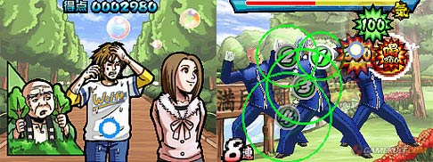

下列为 osu! 的基本游戏玩法，以及游戏的得点系统与分界面。

游戏玩法
========

我可没玩过 "应援团" - 这到底是什么来的啊？
------------------------------------------

嗯，那么先来个说明吧。“应援团”是任天堂DS的音乐节奏游戏。基本玩法有三项，即：

1.  点击银幕上的圈圈
2.  在指定的“滑条”上拖着一粒球
3.  快速旋转大轮盘

这个游戏的每个关卡，是架构在当下流行日文歌曲(的翻唱)的节奏内，以下为图片简介

游戏在DS下方银幕进行,上方则是故事的进展程度，会随着玩家演出的好坏而变。每一个关卡是一个故事，讲叙每个关卡的主人所遇到的困难；魔法般的应援团（即日本传统式的加油队伍)必须支援主人走出困境。

我要怎么玩这游戏啊？
--------------------

虽然不是人人都有个平板电脑(tablet PC)，但是这游戏支援滑鼠操控，其实只要是输入硬件都可以拿来玩游戏（Synaptics触摸板也可，Wii Remote也可，数位板 (graphics tablet) 也可）。有些歌曲虽然对于滑鼠操控呈现了极高难度的挑战，但经过鉴定后，用滑鼠过关并非不可能的任务哦！另外，听起来用Synaptics触摸板完成游戏似乎是种不可能的任务，但是只要配合[几个小软件](http://puu.sh/u9x9)，再加上一段时间的练习，打出好成绩也不是不可能的哦！如果想了解更多关于使用Synaptics玩osu!的信息，请看<http://tieba.baidu.com/p/1583861538>

那么，接下来是游戏玩法的介绍。

### 进入游戏

首先看看有没有打开菜单栏。如果有，osu!图标旁边将会有四个按钮。如果没有，那就在游戏主界面上面晃动鼠标或者点击osu!图标。

出现的四个按钮分别为**"Play"（玩）**, **"Edit"（编辑）**, **"Options"（设置/选项）**,和**"Exit"（退出）**

点击**"Play"**之后，四个按钮将分别为**"Solo"（单人）**, **"Multi"（多人）**和**"Back"（返回）**

点击**"Solo"**按钮后可以选择模式(osu!标准模式、[太鼓模式(Taiko)](ZH:Taiko "wikilink")、[接水果模式(Catch the Beat)和](ZH:Catch_The_Beat "wikilink")[osu!mania模式](osu!mania "wikilink"))、歌曲和难度，然后开始游戏。

点击**"Multi"**按钮后将出现房间列表和聊天窗口。点击房间以加入多人游戏，或者点击New Game以建立房间。请参见[Multiplayer](Multiplayer "wikilink")(English)。

下面开始介绍osu!标准模式的游戏玩法。

#### 点击圈圈 (Hit Circle)

上图为玩家必须点击的圈圈。外面的颜色圈圈会缩到有白色边缘的圈圈上，而玩家的目的是在颜色圈圈与白色边缘合在一起的同时，点击圈圈让它消失不见。

光肉眼瞪着这些圈圈是不够的；随着音乐的节奏来点击这些圈圈乃上上策。

#### 滑条 (Slider)

如上图所显示，这里面多加了个滑条。首先，同样点击圈圈的方式，但是点击之后不要放手。点击之后顺着滑条跟着球走即可 （球只会沿着滑条走，切记）

有时，滑条的另一边（如上图）会有折返指示；您只需要顺着原来的滑条倒退即可。

#### 大轮盘 (Spinner)

上图乃大轮盘。单击并按住鼠标，然后在蓝色圈圈没有缩到中间之前快速旋转轮盘以至过关。轮盘旁有显示让您了解您是否过了这一关的轮盘。玩任天堂DS时，这是刮坏银幕（或者银幕保护膜）的最佳办法。

了解osu!大多玩家是滑鼠用户，所以大轮盘不会比DS游戏内的难。

单击按住鼠标时，您的滑鼠会“锁”进轮盘旋转区内，所以您大可以试着抓狂般的旋转，又或者慢慢转小圈圈 - 随您所好。在此建议您边看他人的重播演出，边练习。

### 游戏之内的界面

以上为游戏之内的界面。

左上角为生命值显示。生命值会随着时间流逝，但是只要能够点击到/完成 点击圈圈，滑条或大轮盘，生命值是可以一直回复的。相对的，一个失误足以造成生命值大跌。

右上角为总积分，详细说明清往下参详。

左下角为combo值显示。

欲知游戏的操作，不妨看一下玩家录像，或许对您帮得上忙呢！

积分/准确度的方程式
-------------------

### 准确度(Accuracy)

在此，每一个点击圈圈，滑条（包括滑条上的小豆豆以及滑条的开始、结束），大轮盘皆为“点击”。

准确度 = 准确度总计/（点击总计\*300）

点击总计 = （点击失误总数+ 点击50总数 + 点击100总数 +点击300总数)

准确度总计 = (玩家点击50总数\*50 + 玩家点击100总数\*100 + 玩家点击300总数\*300)

换句话说，失误不算分，点击50，100，300分别是50，100，300分，把这些数目总合起来，再除以点击总计乘以300，可算出您的准确度。 如果您的所有点击皆为300，准确度将会是100%； 如果您的所有点击皆为100，准确度将会是33.3%。

### 积分(Scoring)

在此先声明： 1. Combo - 连打。Combo值会随着您连续的点击成功而上升（成功的定义为最少50分判定） 2. Mod - 难度调整器。在开始完一首歌之前，您可以按F1选择您要的难度调整器（详细清您参考此FAQ的《游戏界面》篇。）

每一次点击成功的得点，将以下列方程式计算：

得点 = 点击值 + 点击值\*（Combo倍数\* Difficulty倍数\* Mod倍数)/25

点击值 = 点击判定 (50, 100 or 300)。 Combo倍数= (此连打值 - 1) 或 0, 较高数字优先。 Difficulty 倍数= 歌曲难易度的计分倍数。 Mod 倍数= 您所选择的所有难度调整器的总计倍数。

滑条的点击计算为：始，末，回转为30分，滑条上的小豆豆每粒10分。

大轮盘每一次成功转好是100分，如果轮盘过关之后再继续转，后续的每一圈附加额外1000分。

### 点击判定(Judgement)

依照节奏点击，您每一次的点击将分为300，100，50计算，全靠您点击时到底有多准确。 没有点击圈圈，又或者点击过早，将会是个失误判定。 滑条的判定就稍稍不同，准确度是依靠滑条的开头、结尾和路上的小豆豆(称为Tick)。如果您能完全跟好滑条，那么你的判定是300，如果超过一半的豆豆就是100，就一个或以上还是可以得到50。只有完完全全没按到滑条的开头、结尾和小豆豆中的任意一样时才会以失误计算。 附带声明，如果按的太早，**combo值将会归零并且相当于没有点击到滑条的开头，但只要后面跟上来了，还是不会计算为失误**。

大轮盘的判定依靠的是您转轮盘的次数。转大轮盘的时间长短，会对大轮盘的过关要求造成相对的调整。如果没有办法到达一定的要求，那么会对您的大轮盘造成失误判定。

### Combo值

下列为增加combo值的条件:

-   成功点击圈圈。
-   成功点击滑条开端。
-   成功完成滑条。
-   成功越过滑条上的小豆豆。
-   成功完成大轮盘。

下列为combo值归零的条件:

-   没有成功点击圈圈。
-   没有成功点击滑条的开端，或者没有越过其中一个或几个小豆豆。
-   没有成功完成大轮盘。

下列对combo值没有影响:

-   没有成功越过滑条尾端。
-   在大轮盘末端转出了更多的分数。

### 成绩发表(Grades)

SS

100% 准确度
S
=====================================

超过 90% 300, 少过 1% 50， 无失误.
A

超过 80% 300<b>并</b>无失误 或者 超过 90% 300。
B
===============================================

超过 70% 300<b>并</b>无失误 或者 超过 80% 300。
C

超过 60% 300。
D
=====================================

其他。
银色 S 或 SS 意味着玩家玩歌曲时，使用了 'hidden' or 'flashlight' 难度调整器并达到了S或SS的要求。

### 生命显示(Life bar)

生命值的计算方程式，在此将不给予详细商讨，因为实在是太复杂了。但是重要的是，每一首歌生命值的跌落速度是可以调快或调慢的，这完全取决于歌曲的作者设置的HP Drain值。

下列是生命值增加的条件:

-   成功点击圈圈。(点击判定越好，所获得的生命增加会越高。点击颜色combo的尾端会给予较多的生命增加）
-   成功点击滑条开端，越过滑条上的小豆豆，以及完成滑条。（判定越好，所获得的生命增加会越高）
-   成功完成大轮盘。

下列是生命值减少的条件:

-   没有成功点击圈圈。
-   没有成功点击滑条的开端，或者没有越过小豆豆。
-   没有成功越过滑条尾端。
-   没有成功完成大轮盘。

其他特殊游戏模式
================

太鼓(Taiko)模式怎样玩？
-----------------------

[200px|thumb|right|Taiko 界面](image:taiko.jpg "wikilink") 向那些不熟悉的人介绍一下吧，太鼓达人是Namco制作的太鼓音乐类游戏，根据音乐的节奏敲击模拟出来的鼓。在osu!里，您可以用太鼓模式来玩您所喜欢的beatmap。

和osu!类似，太鼓模式也有三大基本要素：

#### 基本节拍

它们会以一个橙色或一个蓝色的圈圈出现。如果是一个橙色的圈圈，您需按下任意属于鼓面的按键（鼠标左键，或者是在设置菜单里设置为具有相同功能的按键）。

如果是一个蓝色的圈圈，那您就按下鼠标右键或者具有同一功能的按键。您需在圈圈到达游戏界面里状态条上，鼓右边的小圈的时候按下按键。

如果是一个大的圈圈，你可以按下全部两个是属于鼓面或者鼓边的按键（这要看你的具体设置）来获得额外的分数。

#### 鼓的滚动条

这个表现为黄色的长条。您要在这个时候按照歌曲的节奏适当的按下按键来获得较高的分数。

#### 拨浪鼓

这个形状类似于轮盘，完成方法类似于太鼓达人中的气球。您需要在时间耗尽之前完成上面标注的次数的按键动作。这时您需要轮流按下属于橙色和蓝色的按键直到时间耗尽或数字减至0。

#### 控制

太鼓模式的默认按键为：

橙色圈圈：滑鼠左键，X键，C键； 蓝色圈圈：滑鼠右键，Z键，V键。

您可以在设置界面的input菜单更改按键，以符合您的按键习惯。

注意的是，在太鼓模式里面光标的位置是没有关系的，放在哪里都一样。

什么是“接水果”(Catch the Beat,CtB)？
------------------------------------

接水果是继太鼓模式后，第二个加入的特别游戏模式。这里您不需要点击圈圈，取而代之的是控制一个在屏幕底部的小人接住从天而降的水果。

#### 控制

在默认设置里面，左方向键和右方向键控制接水果的小人，在按方向键的时候按住左shift键可以加速移动（此时小人会围绕着白色的光晕）。

如果进行游戏时您加上了Relax模式，那样你只需移动鼠标便可控制小人的移动。

某些谱面可能加入了在接水果模式里不能接到的大距离节奏，此时游戏程序会自动加快小人的移动速度，并且会在背景显示红色以作提示。

什么是“osu!mania”? (翻译未完成)
-------------------------------

")

osu!mania是继太鼓和接水果模式后，第三个加入的特别模式

这种模式已几乎被广泛应用在所有主要的节奏游戏上。当note落下时，玩家必须在它抵达终点的那一刻要按下正确的按键。

虽然这模式是模仿Beatmania的风格来制造，但是，玩家可以更改键位的数量，是它看起来像Guitar Hero (5个键位)、Dance Dance Revolution (4个键位)等等.

到目前为止，你可以将键位的数量更改到4个~8个。

### 控制

  There two different binding-styles, *Symmetrical* and *Left to Right*. (Can be found in Options-&gt;Input)

-   *Symmetrical* style mimics the button placement of DJMAX, in which the center key is "spacebar", in which, created a feeling of "stepping" the pedal similar to the arcade version. Centre key matches the middle column (5K and 7K only) and the other column matches the keys in its corresponding place.
-   *Left to Right* style mimics the button placement of Beatmania IIDX, where the first column matches to the key1, then the second column matches the key2 and so on.

*Symmetrical* key binding (For DJMAX style)

-   For *left* hand buttons — (K1)**A**, (K2)**S**, (K3)**D**, (K4)**F**
-   For *right* hand buttons — (K6)**J**, (K7)**K**, (K8)**L**, (K9)**semicolon ";"**.
-   *Center* button — (K5)**spacebar**. \[On 5K and 7K only\]
-   The *Special* button — **left SHIFT** and **left control "Ctrl"**.

*Left to Right* key binding (For Beatmania IIDX style)

-   From down to up then down to up again: (K1)**Z**, (K2)**S**, (K3)**X**, (K4)**D**, (K5)**C**, (K6)**F**, (K7)**V**, (K8)**G**, (K9)**B** \[K9 is not used\]
-   The *Special* button — **left SHIFT** and **left control "Ctrl"**.

<table style="width:19%;">
<colgroup>
<col width="3%" />
<col width="15%" />
</colgroup>
<thead>
<tr class="header">
<th align="center">
Key
</th>
<th align="center">
Symmetrical binding
</th>
</tr>
</thead>
<tbody>
<tr class="odd">
<td align="center">
4K
</td>
<td align="center">
K3, K4
</td>
</tr>
<tr class="even">
<td align="center">
5K
</td>
<td align="center">
K3, K4
</td>
</tr>
<tr class="odd">
<td align="center">
6K
</td>
<td align="center">
K2, K3, K4
</td>
</tr>
<tr class="even">
<td align="center">
7K
</td>
<td align="center">
K2, K3, K4
</td>
</tr>
<tr class="odd">
<td align="center">
8K
</td>
<td align="center">
K1, K2, K3, K4
</td>
</tr>
</tbody>
</table>

<table style="width:19%;">
<colgroup>
<col width="3%" />
<col width="15%" />
</colgroup>
<thead>
<tr class="header">
<th align="center">
Key
</th>
<th align="center">
Left-To-Right binding
</th>
</tr>
</thead>
<tbody>
<tr class="odd">
<td align="center">
4K
</td>
<td align="center">
K1, K2
</td>
</tr>
<tr class="even">
<td align="center">
5K
</td>
<td align="center">
K1, K2, K3, K4, K5
</td>
</tr>
<tr class="odd">
<td align="center">
6K
</td>
<td align="center">
K1, K2, K3, K4, K5, K6
</td>
</tr>
<tr class="even">
<td align="center">
7K
</td>
<td align="center">
K1, K2, K3, K4, K5, K6, K7
</td>
</tr>
<tr class="odd">
<td align="center">
8K
</td>
<td align="center">
K1, K2, K3, K4, K5, K6, K7, K8
</td>
</tr>
</tbody>
</table>

Common Issues
=============

我的上榜分数没有增加！这是个bug么？
-----------------------------------

不，这不是bug。

首先，请先检查您是否连接上了因特网，同时在游戏里是否已经登录。在游戏尚未登录的时候您所取得的所有分数都不会算入您的上榜总分数，而只会显示在本地的分数榜上面。

而且，上榜总分数只计算您在同一谱面取得的最高分数。而不是一个谱面的所有难度的分数都算入上榜总分数。

举个例子，我在以下三个谱面里的不同难度取得了如下的分数：

-   BRANDY - The Festival of Ghosts 2
    -   Relaxing : 3,000,000
    -   DaRRi MIx : 5,000,000
-   ZZ - Samurai Blue
    -   Easy : 500,000
    -   Normal : 1,000,000
    -   Hard : 没有分数
-   Matchbox 20 - How Far We've Come
    -   Normal : 2,000,000
    -   Hard : 1,500,000

我在每张谱面取得的总的最高分数是5,000,000 + 1,000,000 + 2,000,000 = 8,000,000，这同时也是我的上榜总分数。

需要留意的是，您在approved的谱面里取得的分数不会算进您的上榜总分数(但是会计算准确度，也会让你获得pp)。approved的map会用“箭头”标志来标明，和以“爱心”标明的上榜谱面有所区别。 另外，Pending的谱面里取得的所有分数均不会算进您的上榜总分数，也不会计算准确度。Pending的map会用“问号”标志来标明。最常见的Pending例子是内置的教程(osu! tutorial)。

我可以关掉一些影响我游戏的东西吗
--------------------------------

#### Kiai Time（高潮时间）

虽然Kiai Time在开始时会制造出闪光和喷泉，并且在游戏过程中导致屏幕上的全部物件闪烁，但是很遗憾，不可以哦～

#### 背景图片

可以，请：

-   利用内置的“Background Dim”（背景变暗）功能。先进入游戏界面，然后在最开始或者暂停游戏时将鼠标移动到靠近游戏界面下边缘附近（会弹出**Visual Settings**），然后将Background Dim滑块移动至可接受的程度即可。这个选项的默认值是30%。这种方法是无法彻底清除背景图的。如果需要彻底清除背景图（虽然不建议这么做），请：
-   使用其他的图片来覆盖歌曲文件夹中的背景图片文件。打开osu安装目录里面的Songs文件夹，然后找到歌曲，再把文件夹里面歌曲的背景图换掉就好了。如果看不出哪一张是背景图的话，打开预览来和osu!里面的图比较或者用记事本等文本编辑器来打开一个osz文件，然后找到**\[Events\]**里面的图片文件。

#### 背景视频

可以，只要在选项或Visual Setting里禁用就好了。这个选项不影响成绩。

#### Storyboard

可以，在选项或Visual Setting里禁用。 **如果这张图有"Epilepsy Warning"（闪光警告），建议将其关闭，以阻止不必要的危险发生。**

#### 图的自定义皮肤

可以，在选项或Visual Setting里禁用。

这些map太难了，有没有一些简单点的介绍一下？
-------------------------------------------

Pokebis 已经收集了一些适合初学者玩的谱面。您可以在这里[下载](http://osu.ppy.sh/forum/viewtopic.php?t=5456)。

同时，您可以[按照难度来对谱面列表进行重新排序](http://osu.ppy.sh/?p=beatmaplist&s=3)。最容易的谱面就在列表的最上面。

您也可以看[这一帖](http://osu.ppy.sh/forum/viewtopic.php?f=25&t=13976)，Alace为中文玩家整理了一些简单的谱面并作了难点分析。挑选适合自己的谱面开始您的osu!旅程吧！

Level的用途是什么?是放爽的吗?
-----------------------------

是的，是放爽的，请原谅当时peppy太无聊 XD

Level是根据你在线时所累积的分数(及时你中途失败也会计算在内)计算的。其计算公式是:

`5,000 / 3 * (4n^3 - 3n^2 - n) + 1.25 * 1.8^(n - 60), where n <= 100`
`26,931,190,829 + 100,000,000,000 * (n - 100), where n >= 101`

级别的数目会在进度条旁显示。

*注意：* 如果你要从 level 101 上升至 level 102，你必须要得到1,270,000,000分。

为什么我的rank和pp不一样(变少)了?!!!!
-------------------------------------

你人品有问题，所以系统代替月亮来惩罚你(割

你可能在看着其他模式的rank和pp，请在最上边选择你正在玩的模式: 

为什么我玩游戏时会看到一些类似白雾的东西?
-----------------------------------------

请确保smoke/skywriting的按键和你玩游戏时使用的按键是不一样的: 

专用名词
--------

随着游戏的发展，游戏玩家中交流用的专用名词也出现了不少。下面是几个比较常用的名词：

-   触手(神手)：指游戏技术十分高超的玩家
-   沙包(初学者)：指各方面均不熟练的普通玩家
-   纯鼠：即只使用鼠标进行游戏
-   键鼠：使用鼠标移动，用键盘来点击
-   纯板：只使用数位板进行游戏
-   键板：使用数位板移动，用键盘来点击
-   双刀：用键盘点击的同时，鼠标或数位板也承担一部分点击操作
