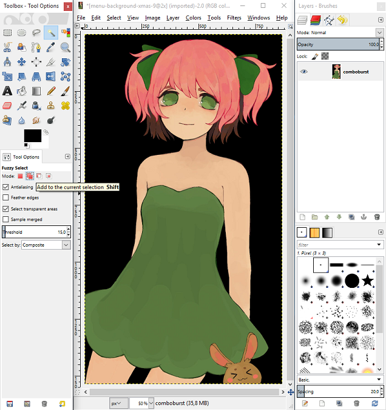
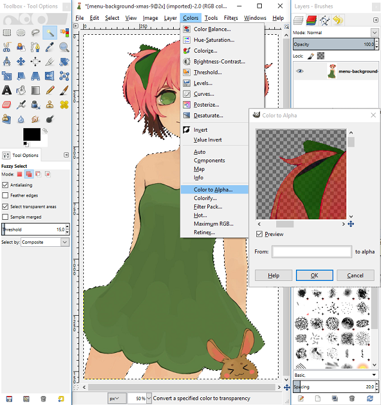
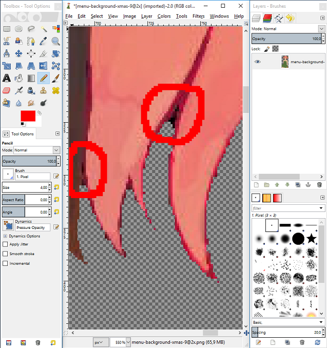

# Rogner des arrières plans simples

Je vais vous montrer une manière rapide d'enlever un arrière-plan uni. Comme dans le tutoriel précédent, j'utiliserais GIMP et l'image ci-dessous.

## Étape #1

Sélectionnez l'outil de sélection contiguë en mode "Ajouter à la sélection actuelle" (cela aidera a sélectionner des petites parties) et sélectionnez chaque zone noire de l'arrière plan que vous ne voulez pas.

## Étape #2

Maintenant que nous avons sélectionné l'arrière-plan, nous devons agrandir la sélection d'un pixel. Pressez `Suppr` pour supprimer l'arrière-plan sélectionné.

## Étape #3

Il est temps d'utiliser notre filtre pour rendre l'arrière-plan supprimé transparent.

## Étape #4

Malheureusement après tout cela, il reste des espaces noirs. Souvent dans les angles du personnage. Choisissez l'outil en forme de lasso et sélectionnez ces endroit affreux. Pressez  `Ctrl` + `F` pour répéter la suppression de la couleur.

## Fin

Après avoir supprimé les restes, votre image sera prête.

Cette méthode fonctionne seulement avec les arrières-plans de couleur unie, mais vous pouvez supprimer rapidement un arrière-plan avec cette méthode.

