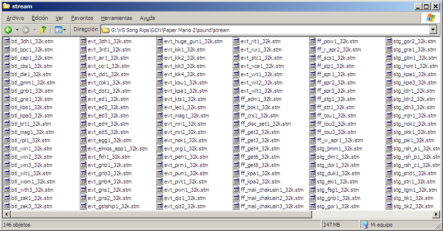

# Obtenir des chansons de jeux vidéo

Ce tutoriel est destiné aux mappeurs qui veulent une chanson de jeux vidéo, principalement des consoles comme la PS2, GCN/Wii, Xbox 360, etc. Il peut inclure des consoles portables et plus anciennes (voir SNES, PS1, PSP, N64, NDS, etc.) mais il faut plus de choses pour obtenir les musiques venant de ces consoles.

## Avant de commencer

Ce tutoriel nécessitera plusieurs choses. Ils seront énumérés au cas où vous ne les auriez pas, de sorte que si vous ne les avez pas, vous pourrez les télécharger ou chercher des informations complémentaires à leur sujet :

-   **foobar2000.** Ce tutoriel utilise la v1.1.15 qui est la dernière version stable au moment de l'écriture de ce tutoriel. Téléchargement [ici](https://foobar2000.org/download).
-   **vgmstream decoder plugin.** Ce tutoriel utilisera le plugin foobar2000 (version utilisée : r1002) mais si vous savez comment utiliser la version autonome, vous pouvez l'utiliser. Téléchargement [ici](https://foobar2000.org/components/view/foo_input_vgmstream). Version Standalone [ivi](https://vgmstream.losno.co).
-   **LAME Encoder.** Ceci est nécessaire pour convertir la chanson au format MP3 afin que vous puissiez la charger dans [osu!](/wiki/Glossary) et commencez à mapper ! Téléchargement [ici](https://rarewares.org) (Sélectionnez LAME Bundles dans le menu MP3).
-   **Une sauvegarde extraite de votre jeu.** Ceci est nécessaire pour obtenir la chanson désirée. Cependant, vous devriez obtenir la sauvegarde par vous-même. Ce tutoriel utilisera _Paper Mario : La porte des mille ans_ comme notre jeu.

## Démarrage

Téléchargez et installez d'abord les applications requises sur votre ordinateur (si vous ne l'avez pas encore fait). Une fois qu'elles sont installées, ouvrez foobar2000 et ouvrez l'Explorateur Windows dans le dossier musique de votre sauvegarde extraite.

_Note : Le nom du dossier peut varier selon le jeu. Les noms habituels du dossier musique sont **stream, sound, bgm, music**._

_Note 2 : Certains jeux utilisent une extension différente ou pas d'extension du tout en raison de limitations du moteur/plaintes des programmeurs/quel que soit le motif. En général, une recherche sur Google peut vous donner des informations sur ces jeux spécifiques._

## Chargement de notre chanson

Une fois que vous êtes dans le dossier musique du jeu, il est temps de charger les chansons sur foobar2000. Pour ce faire, sélectionnez tous les fichiers du dossier et faites-les glisser vers la fenêtre de foobar. Une fois que les chansons sont chargées, écoutez-les jusqu'à ce que vous arriviez à la chanson souhaitée. Dans ce tutoriel, nous recherchons le _Chapitre 3 Boss Battle Theme_ (Nous ne pouvons pas gâcher le vrai nom pour ceux qui jouent encore au jeu :p) donc notre fichier est **btl_gns1_32k.stm**.

## Conversion

Une fois que vous avez la chanson que vous convertissez, cliquez avec le bouton droit de la souris sur la chanson dans la liste de lecture, sélectionnez _Convertir_, puis l'option _..._. Cela vous amènera à un dialogue vous permettant de choisir comment la conversion sera effectuée.

Cette liste vous donnera la bonne configuration pour les convertir pour osu!

-   **Format de sortie:** Format : MP3 (LAME), V2. _(Le débit se réglera sur 190kbps)_
-   **Destination:** Dossier de sortie : dossier du fichier source. Type de sortie : pistes dans des fichiers individuels. Modèle de nom de fichier : %title%.
-   Traitement : Limiteur de -6dB en dur. _(Facultatif)_
-   **Autre:** Quand c'est terminé : ne faites rien.

_Note : Si vous n'avez pas encore converti en MP3 dans foobar2000, le convertisseur vous demandera de localiser **lame.exe**. Naviguez jusqu'au dossier où vous avez extrait **lame.exe** et sélectionnez le fichier._

Une fois que vous avez défini vos options, cliquez sur le bouton _Save_ et lorsqu'il vous demande d'écraser le préréglage, cliquez sur _Save as new_. Donnez-lui un nom afin de pouvoir convertir rapidement les futures chansons. Une fois que vous êtes prêt à convertir, cliquez sur le bouton _Convertir_ pour que le processus de conversion puisse commencer. Une fois la conversion terminée, recherchez le fichier résultant dans le dossier. Dans notre cas, le fichier est **btl_gns1_32k.mp3**.

## Finition

Une fois que nous avons notre fichier converti, chargez-le dans foobar2000 ou dans votre lecteur de musique préféré pour vérifier si la chanson a été convertie dans votre lien, sinon, vérifiez les paramètres de conversion jusqu'à ce que vous ayez un fichier approprié. Une fois que le fichier est prêt, faites-le glisser dans la fenêtre d'osu!, remplissez les balises et commencez le mapping !
