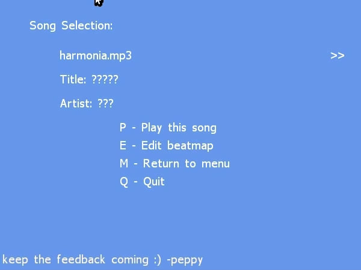
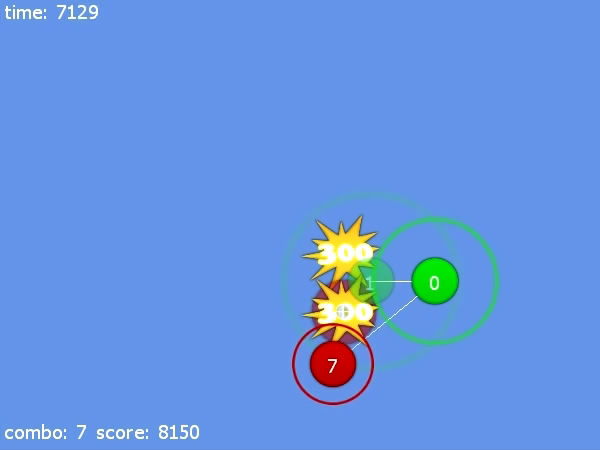
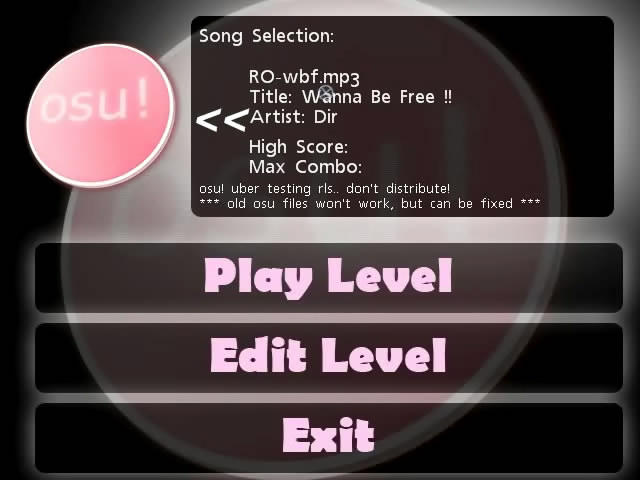
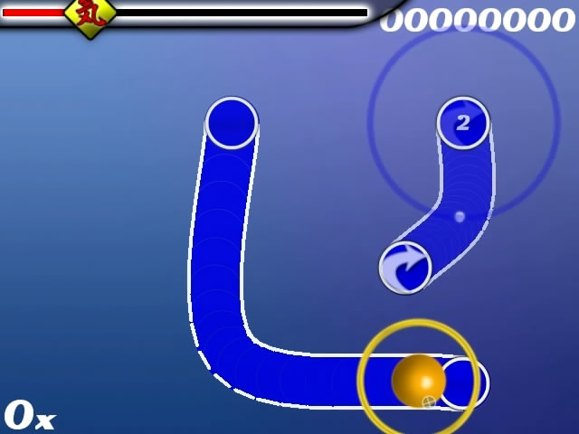
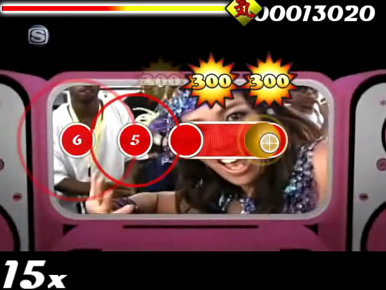
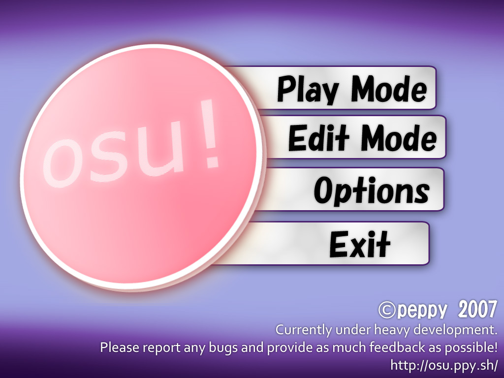
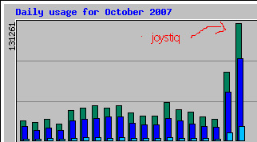
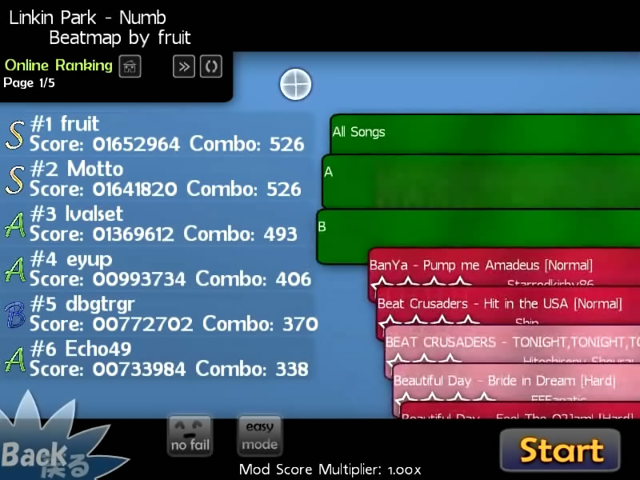
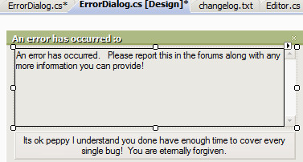

# 2007

*Página principal: [Historia de osu!](/wiki/HOO).*

Lo siguiente es parte de la historia de osu! desde su comienzo. Gracias especiales a [Sinistro](/users/5530) por ayudar a compilar el contenido de 2007/2008.

## Julio

osu! comenzó como una prueba de concepto llamado "ouentest". La primera versión fue lanzada en 2007-07-01 a un pequeño grupo de amigos íntimos de Peppy que contenía un editor y modo de juego muy básico. El editor no contenía funciones de busqueda o ajuste, por lo tanto solo se podían hacer beatmaps simples. En este punto aún no habían deslizadores o ruletas, pero estaba presente un contador básico de combo/puntaje. La primera versión tomó aproximadamente 16 horas de codificación y se realizón en un *single all-nighter*. `pUpdater` fue introducido (que pronto se conocerá como `osume`) para gestionar actualizaciones a versiones más actuales.

A fines de Julio, El sistema de menú fue cambiado para añadir un poco de estilo al juego. Se completó una implementación inicial de deslizadores, con una bola deslizante naranja no animada y algunas curvas relativamente feas. La sincronización del tiempo se agregó al editor, como una línea de tiempo y una interfaz de edición más robusta (muy similar a lo que ves en [Compose](/wiki/Compose) actualmente).

## Agosto

El menú principal fue actualizado con un nuevo diseño, y el editor recibió muchas mejoras, incluyendo un soporte para copiar y pegar. Se agregó la barra de menú y el cursor de Windows, haciendo funciones del editor mucho más accesibles que antes. Los deslizadores eran mucho mejor soportados, con ticks presentes y desapareciendo cuando la bola deslizadora los pasa. Apilamiento de círculos estaban presentes. Los puntajes locales estaban mucho mejor soportados. El formato de archivo `.osu` fue revisado y completamente renovado, pero incluye la conversión de archivos antiguos al nuevo formato.

La jugabilidad se vio mejorada con el debut de [combo fire](/wiki/combo_fire), la barra de HP, rastros del ratón, y mejores deslizadores. En este punto, osu! tenía una humilde colección de alrededor de 10 beatmaps diseñados por el equipo de prueba de alrededor de 5 personas.

## Septiembre

2007-09-17 fue el nacimiento de osu! en lo que respecta al público. los foros que conocemos actualmente fueron establecidos, y alojados desde el dominio de origen de Peppy (`ppy.sh`). La atención se obtuvo a través de un anuncio de noticias en <http://www.bemanistyle.com> 
que atrajo a bastantes personas interesadas con experiencias anteriores en juegos de ritmo.

")

Rápidamente después del lanzamiento público, los primeros mods, [Easy](/wiki/EZ) y [No Fail](/wiki/NF), fueron integrados, así como secciones de descanso (que hasta ahora habían sido ignoradas). Una gran cantidad de cambios hizo que osu! rápidamente se viera más y más como un juego de ritmo comercial.

") ")

## Octubre

2007-10-01 fue el día en que las clasificaciones en línea se pusieron a disposición públicamente. Esto también vio el lanzamiento del método de empaquetado `.osz`, y la base de datos de beatmap en línea con un sistema de envío temprano basado en la web. Las clasificaciones en línea fueron añadidas a la interfaz de en-juego y también mostradas en la página.

La pantalla para seleccionar canciones vio mejoras, con agrupación de dificultades y un movimiento más intuitivo de rueda. Conjunto de muestra más suave, controles basados en teclado, todas las búsquedas dentro del juego se originan en este mes. Los jugadores podrían hacer skins universales y por beatmap por primera vez y se implementó el soporte total de TabletPC.

La versión 2 de `pUpdater` (`osume`) fue lanzada, compatible con descargas de paquetes opcionales. Esto incluyó hacer que los primeros skins hechos por el usuario estén disponibles para todos los jugadores a través del actualizador. El editor vio la implementación de [distance-based snapping](/wiki/Distance_Snap), soporte de marcadores, múltiples tipos de curvas para los deslizadores, colores customizados, juego de prueba, tiempo de entrada, y mucho más.

## Noviembre

El resultado SS fue agregado al sistema de calificaciones, reemplazando el resultado S en casos de perfección dentro del beatmap. El mod [No Video](/wiki/NV) y [Hidden](/wiki/HD) fueron introducidos, y los resultados SH (S de plata) y SSH (SS de plata) van con esto. Por primera vez, Los jugadores podrían asignar skins y conjunto de muestras normales o suaves por sección de tiempo. Los archivos `.osz` pueden ser cargados presionando dos veces sobre estos, o arrastrandolos hasta el ícono de osu!.

") ")

---

")

El sistema [Beatmap Submission System](/wiki/Beatmap_Submission_System) (BSS) se hizo público, permitiendo a los usuarios subir y compartir de forma sencilla sus creaciones. Esto introdujo la sección de mapas pendientes y en el ranking lo que ayudó a organizar la creciente y rápida colección de beatmaps subidos por los usuarios. Chat dentro del juego fue introducido, con un cliente IRC construido en scratch y conectado a un servidor IRC estándar (todavía no existe Bancho) El chat ampliado era visible. Avatars y otras estadísticas básicas se mostraban en el juego (usando una comunicación basada en http). Control de audio fue introducido al menú principal, que también reproduce una canción al azar al inicio. Las repeticiones de records locales o en línea pueden ser vistas por el usuario. Los jugadores pueden espectar a otros (¡y los datos del espectador se enviaron sin procesar a través de IRC!).

## Diciembre

Las canciones pueden ser editadas al ser arrastradas a la venta de osu!. Infromación sobre herramientas fueron incluidas; explicando todos los diversos botones en el menú e interfaz del editor de osu!. Muchos skins de calidad fueron presentados por desarrolladores con experiencia ([Holiday by LuigiHann](http://osu.ppy.sh/forum/t/1139/start=0), [WindWaker by awp](http://osu.ppy.sh/forum/t/761/start=0)). Nuevos métodos de clasificación en la pantalla de selección de canciones. Peppy ahora podría enviar anuncios universales a todos los jugadores de osu!. Se hicieron ajustes pequeños a la jugabilidad, como el oscurecimiento de círculo no activo.

