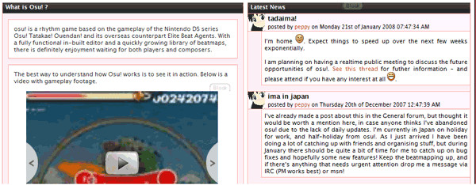

# Storia di osu! 2008

## Gennaio

Peppy è stato in MIA (disperso in azione) in Giappone dal 17 dicembre 2007 al 20 gennaio 2008. In qualche modo è riuscito ad allontanarsi dall'osu! codebase per un mese intero, quindi non ci sono stati aggiornamenti importanti (mentre la comunità era piuttosto stagnante durante questo periodo).

## Febbraio

") ") ")

I giocatori hanno ricevuto sfide extra sotto forma di [mod](/wiki/Gameplay/Game_modifier) ([Hard Rock](/wiki/Gameplay/Game_modifier/Hard_Rock), [Sudden Death](/wiki/Gameplay/Game_modifier/Sudden_Death) and [Double Time](/wiki/Gameplay/Game_modifier/Double_Time)). L'esperienza di gioco è stata notevolmente migliorata con l'aggiunta di immagini e suoni del conto alla rovescia, numeri e colori personalizzati per le combo, classifiche delle sezioni O/X (Passato, Fallito), introduzioni del conto alla rovescia, scripting del colore di sfondo, controllo del volume per la sezione dei tempi e (forse la cosa più importante) l'introduzione del supporto per lo [scripting dello storyboard](/wiki/Storyboard/Scripting). È stato effettuato un tentativo di spostare osu! al framework XNAv2, ma Peppy ha deciso che la nuova versione era inutile e riduceva le prestazioni complessive. Da questo momento in poi è stato utilizzato XNA1.1, che è stato modellato in base alle esigenze di osu! con migliaia di righe riscritte e "hack" per rendere osu! quello che era. È stato inoltre implementato un nuovo motore di rendering del testo, che consente una visualizzazione dei caratteri molto nitida con qualsiasi dimensione. Ciò rende possibile visualizzare più informazioni sull'[editor](/wiki/Client/Beatmap_editor) e rendere il gioco migliore nel complesso.

## Marzo

") ")

Per controbilanciare le nuove mods di febbraio, questo mese sono arrivate le mod [Relax](/wiki/Gameplay/Game_modifier/Relax) (RX) e [Half Time](/wiki/Gameplay/Game_modifier/Half_Time) (HT) per rendere la vita più facile ai giocatori. Gli utenti ora possono acquisire screenshot e importare ed esportare [replay](/wiki/Gameplay/Replay). Per la prima volta le animazioni potevano essere [sceneggiate](/wiki/Storyboard) ed è stata aggiunta la schermata di selezione delle [skin](/wiki/Skinning). Le ottimizzazioni delle prestazioni hanno visto una diminuzione dell'82% nel caricamento della schermata di selezione dei brani (tramite un nuovo formato per il database beatmap locale). Sono state apportate varie altre modifiche alle prestazioni, inclusa l'introduzione del limite dei fotogrammi e una serie di altre opzioni grafiche. Il progetto [Bancho](/wiki/Bancho_(server)) è stato avviato il 24 marzo 2008. L'idea era quella di creare un componente server per la famiglia di osu!, che gestisce le comunicazioni tra gli utenti e rimuovere la dipendenza [IRC](/wiki/Community/Internet_Relay_Chat) (Internet Relay Chat).
