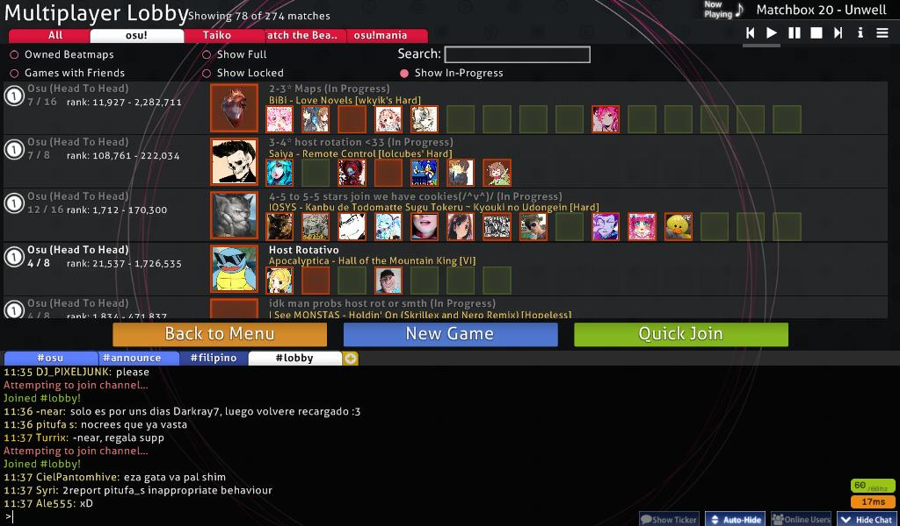
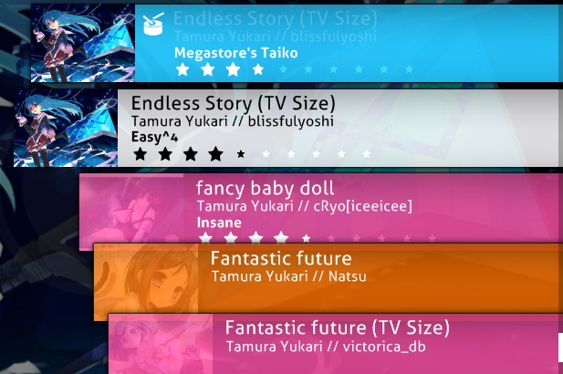
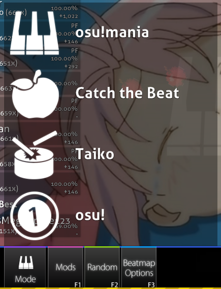
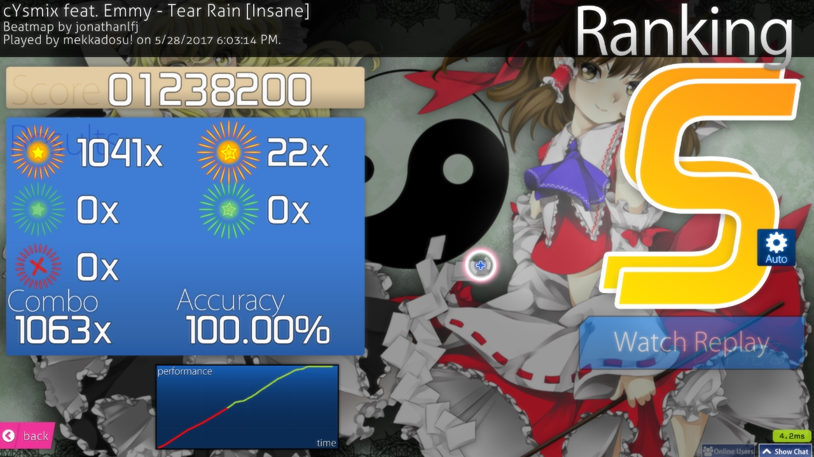
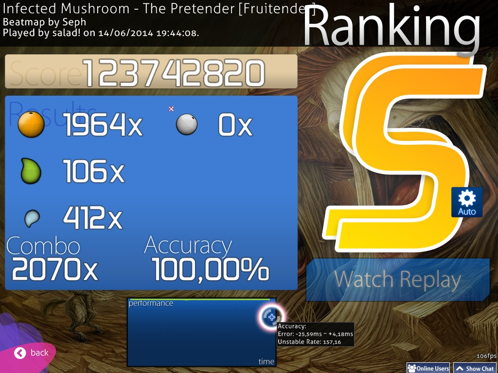
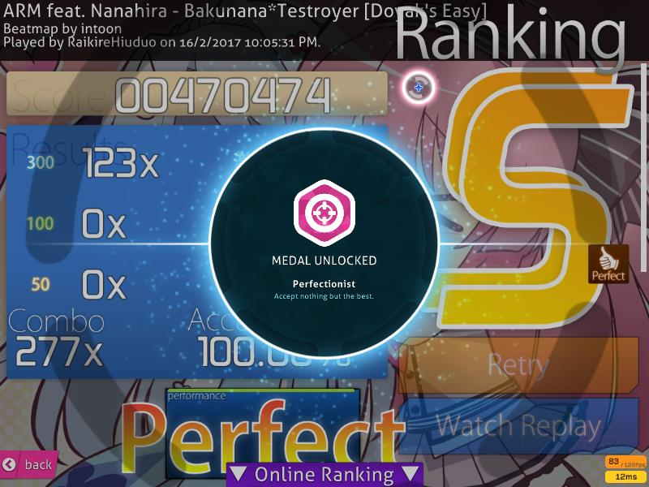

<!-- TODO: formatting kinda sucks. removed `needs_cleanup` tag because at least it gets the job done by explaining the images -->

# Interface

## Hoofdmenu

De [osu!cookie](/wiki/Glossary#cookie) \[1\] Beweegt op en neer aan de hand van de [BPM](/wiki/Beatmapping/Beats_per_minute) van het lied dat op dat moment aan het spelen is in het hoofdmenu. Als aanvulling, balken komen uit de osu!cookie, gebaseerd op het volume van het lied. Als er geen lied aan het spelen is beweegt de osu!cookie op en neer met een slome 60 BPM. De elementen van het hoofdmenu zijn als volgt:

- \[2\] Druk op Play (`P`) of het logo om te switchen naar het lied-selectie scherm in de solo-modus.
- \[3\] Druk op Edit (`E`) om het editor mode lied-selectie scherm te openen.
- \[4\] Klik op Options (`O`) om naar het Options scherm te gaan.
- \[5\] Klik op Exit (`Esc`) om osu! af te sluiten.
- \[6\] Een willekeurige nuttige tip wordt getoond aan de onderkant van het menu.
- \[7\] Linksonder is een link naar de osu! website evenals copyright informatie.
- \[8\] Connectie resultaat naar [Bancho](/wiki/Glossary#bancho)! In deze afbeelding is dit niet te zien, maar dit lijkt op een kettingschakel.
- \[9\] Rechtsonder zijn de chat controls voor het uitgebreide[chat window](/wiki/Chat_Console) (genaamd "Player List") en het reguliere chat window (`F9` & `F8`, respectievelijk).
- \[10\] Rechtsboven is de osu! jukebox, deze speelt liedjes af in willekeurige volgorde. Bovenin kun je zien welk lied op het moment wordt afgespeeld. De knoppen, van links naar rechts, doen het volgende:
  - Vorige lied
  - Play
  - Pause
  - Stop (Het verschil tussen Play en Stop is dat Stop het lied weer vanaf het begin afspeelt, terwijl Pause het lied simpelweg pauzeert)
  - Volgende lied
  - Bekijk de informatie van het lied. Dit wisselt de bovenste balk, die het lied laat zien, tussen permanent en tijdelijk. Als deze permanent is zal de balk zichtbaar zijn totdat hij vervaagt, samen met de rest van de interface. Wanneer de balk tijdelijk is, zal deze verdwijnen korte tijd nadat het lied is gekozen. De balk blijft dan verborgen totdat hij weer wordt gewisselt of een nieuw lied wordt afgespeelt. 
- \[11\] Het aantal beschikbare beatmappen dat je hebt, hoe lang de osu!client al openstaat en jouw systeem klok. 
- \[12\] Jouw profiel, klik erop voor de gebruiker opties (zie hieronder)

## Gebruiker Opties

Je ziet dit scherm wanneer je op je profiel klikt, linksboven in het hoofdmenu. Terwijl je de gebruiker opties bekijkt, heb je geen toegang tot de chat consoles. Je kunt ieder item selecteren door het toets van het bijbehorende nummer van de optie in te drukken:

1. `View Profile`: Opent je profielspagina in je standaard web browser.
2. `Sign Out`: Log uit jouw account. (als je bent uitgelogt zal de [Options](/wiki/Options) sidebar je vragen om weer in te loggen).
3. `Change Avatar`: Opent de edit avatar pagina in je standaard web browser.
4. `Close`: Sluit het gebruiker opties scherm

## Play Menu

- Klik op `Solo` (`P`) om alleen te spelen.
- Klik op `Multi` (`M`) om te spelen met anderen. Je wordt vervolgens naar de [Multi](/wiki/Multi) Lobby gebracht (zie hieronder).
- Klik op `Back` om terug te gaan naar het hoofdmenu.

## Multi Lobby

*Hoofdpagina: [Multi](/wiki/Multi)*

1. Jouw rang in de kamer waarin je speelt. Je kunt je rang ook vinden naast je gebruikersnaam.
2. Jouw profiel informatie.
3. De jukebox.
4. Lijst van spelers, Deze laat hun gebruikersnaam, rang (host of speler), hun geactiveerde mods (Indien er mods zijn geselecteerd, zie \#7), hun osu! rang en hun team (als dit van toepassing is).
5. De naam van de kamer en wachtwoord instellingen.
6. De geselecteerde beatmap. Het laat de beatmap zien, zoals je hem zou zien in het solo lied-selectie scherm.
7. De geactiveerde mods (zie #12) en de optie om mods te selecteren. De optie genaamd "Free Mods" beslist of spelers zelf kunnen kiezen met welke mods ze spelen. Als dit het geval is kunnen ze iedere combinatie van mods gebruiken *Behalve mods die de lengte van het lied aanpassen, zoals Double Time*. Als dit niet het geval is, beslist de host welke mods worden gebruikt. De host kan mods die de lengte van een beatmap kiezen onafhankelijk van de status van Free Mods.
8. De teammodus en win condities.
9. De ready knop.
10. De [chat console](/wiki/Chat_Console).
11. De leave knop.
12. Waar je geselecteerde mods komen te staan.

## Lied Selectie Scherm

Je kunt de geselecteerde spelmodus vinden door linksonder, naar het icoon boven Mode te kijken. Ook kun je naar het transparante icoon, in het het midden van het scherm kijken. De vier gamemodes die je kunt zien zijn:

-  is [osu!](/wiki/Game_Modes/osu!)
-  is [osu!taiko](/wiki/Game_Modes/osu!taiko)
-  is [osu!catch](/wiki/Game_Modes/osu!catch)
-  is [osu!mania](/wiki/Game_Modes/osu!mania)

Omdat dit scherm te veel belangrijke elementen bevatten om te noteren met overzichtelijke nummers, zullen de subsecties hieronder focussen op een deel van het scherm per keer.

### Beatmap Informatie

Dit deel van het scherm laat **Informatie over de moeilijkheid van de geselecteerde beatmap** zien. Dit is de beatmap, wiens lied te horen is in de osu! jukebox voordat je het lied-selectie scherm hebt geselecteerd. Linksboven kun je de status van de beatmap zien. Hiernaast staat de titel. Dit is de geromaniseerde titel, tenzij je de `Prefer metadata in original language` optie hebt geselecteerd. Deze optie is te vinden in het [Options](/wiki/Options) menu, Behalve de titel van het lied zie je ook wie de beatmap heeft gemaakt, evenals informatie over de map. Van links naar rechts betekenen deze waarden het volgende:

- **Length**: De lengte van de beatmap, van het begin tot het eind, inclusief pauzes. Niet te verwarren met [drain time](/wiki/Glossary#drain-time).
- **BPM**: Het aantal Beats Per Minute van de beatmap. Als er, zoals in de onderste afbeelding, twee BPMS zijn en een staat tussen haakjes, betekent dit dat de BPM verandert gedurende het lied. De laagste en hoogste BPM worden hier getoond, en de waarde tussen haakjes, is het aantal BPM aan de start van de beatmap.
- **Objects**: Het totaal aantal [hit objecten](/wiki/Hit_Objects) in de beatmap.
- **Circles**: Het totale aantal hit circles in de beatmap.
- **Sliders**: Het totale aantal sliders in de beatmap.
- **Spinners**: Het totale aantal spinners in de beatmap.
- **OD**: De Overall Difficulty (Algemene Moeilijkheid) van de beatmap.
- **HP**: De snelheid waarmee je HP naar beneden gaat. In osu! dit bepaalt hoe veel HP je verliest, wanneer je een noot mist, hoe snel de balk nietsdoend leeggaat en hoe veel HP je terugkrijgt als je een noot raakt. In osu!mania, dit is precies het zelf afgezien van het verliezen van HP wanneer je niets doet. In osu!taiko dit bepaalt hoe snel je HP balk vult en hoe veel HP je verliest wanneer je een noot mist. In osu!catch werkt dit hetzelfde als in osu!.
- **Stars**: De ster-moeilijkheid van een beatmap. Dit is ook visueel zichtbaar in de beatmap rechthoek zelf.

### Group en Sort

Klik op een van deze tabs om je **liedjeslijst te sorteren aan de hand van geselecteerde criteria**.

**Group** - De meeste opties zetten de beatmaps in verschillende uitbreidbare groepen:

- `No grouping` - Beatmappen worden niet gesorteerd, maar wel geordend bij datgene geselecteerd in Sort.
- `By Difficulty` - Beatmappen worden gegroepeerd bij hun ster-moeilijkheid, afgerond op het dichtstbijzijnde hele nummer.
- `By Artist` - Beatmappen worden gegroepeerd bij het eerste karakter van de naam van de artiest.
- `Recently Played` - Beatmappen worden gegroepeerd bij wanneer je ze voor het laatst hebt gespeeld
- `Collections` - Dit laat de collecties die je hebt gemaakt zien *Waarschuwing! Dit verbergt mappen, die niet in een collectie zitten!*
- `By BPM` - Beatmappen worden gegroepeerd bij hun BPM in meervouden van 60, beginnende met 120.
- `By Creator` - Beatmappen worden gegroepeerd bij het eerste karakter van de naam van de maker van de beatmap.
- `By Date Added` - Beatmappen worden gegroepeerd bij wanneer ze zijn toegevoegt aan osu!, van vandaag tot 4+ maanden geleden.
- `By Length` - Beatmappen worden gegroepeerd bij hun lengte: 1 minuut of minder, 2 minuten of minder, 3, 4, 5, en 10.
- `By Mode` - Beatmappen worden gegroepeerd bij hun gamemode.
- `By Rank Achieved` - Beatmappen worden gegroepeerd bij de hoogste rang behaald op hen.
- `By Title` - Beatmappen worden gegroepeerd bij de eerste letter van hun titel.
- `Favourites` - Laat enkel jouw favoriete beatmappen zien.
- `My Maps` - Laat enkel jouw beatmappen (Degene waarvan de naam van de maker, gelijk is aan jouw gebruikersnaam) zien.
- `Ranked Status` - Beatmappen worden gegroepeerd bij hun status: ranked, pending, not submitted, unknown, or loved.
De eerste vijf groeperingen zijn ook beschikbaar in de tabbladen onder Group en Sort.

**Sort** - Sorteert beatmappen op een bepaalde manier

- `By Artist` - Beatmappen worden alfabetisch gesorteerd op het eerste karakter van de naam van de artiest.
- `By BPM` - Beatmappen worden gesorteerd op hun BPM van laag naar hoog. Indien een map meerdere BPMS heeft, wordt de hoogste waarde gebruikt.
- `By Creator` - Beatmappen worden alfabetisch gesorteerd op het eerste karakter van de naam van maker van de beatmap
- `By Date Added` - Beatmappen worden gesorteerd van oud naar nieuw, gebaseerd op wanneer je ze hebt toegevoegd aan osu!
- `By Difficulty` - Beatmappen worden gesorteerd op ster-moeilijkheid *Waarschuwing! Dit split aparte mapsets*
- `By Length` - Beatmappen worden gesorteerd van kort naar lang bij hun lengte.
- `By Rank Achieved` - Beatmappen worden gesorteerd bij de laagste tot de hoogste rang behaald op de beatmap.
- `By Title` - Beatmappen worden alfabetisch gesorteerd op het eerste karakter van hun naam.

### Search

*Waarschuwing: Je kunt de chat console of de opties sidebar niet open hebben als je wilt zoeken; Anders wordt dat wat je typt gezien als chat tekst of een zoekopdracht in het opties-menu.*

Alleen beatmappen die de criteria van jouw zoekopdracht matchen worden getoond. Deze zoekopdracht wordt gematcht met de artiesten, titels, makers en tags van de beatmappen.

Behalve deze velden, kun je ook filters gebruiken om anderen metadata te combineren met je zoekopdracht door een waarde te gebruiken bij de filter (bijvoorbeeld, `ar=9`).

Ondersteunde filters:

- `artist`: Naam van de artiest
- `creator`: Naam van de maker van de beatmap
- `ar`: Approach Rate (Naderingssnelheid)
- `cs`: Circle Size (Cirkelgrootte)
- `od`: Overall Difficulty (Algemene Moeilijkheid)
- `hp`: HP Drain Rate
- `keys`: Aantal keys (werkt enkel op osu!mania mappen)
- `stars`: Ster-moeilijkheid
- `bpm`: Beats per minuut
- `length`: Lengte in secondes
- `drain`: Drain Time in secondes
- `mode`: Mode. Waarde kan zijn: `osu`, `taiko`, `catchthebeat` of `mania`. De verkorte versies zijn: `o`/`t`/`c`/`m`.
- `status`: Status van de beatmap. Waarde kan zijn: `ranked`, `approved`, `pending`, `notsubmitted`, `unknown` of `loved`. De verkorte versies hiervan zijn: `r`/`a`/`p`/`n`/`u`/`l`.
- `played`: Tijd sinds je de beatmap voor het laatst hebt gespeeld in dagen.
- `unplayed`: Ongespeelde mappen. Dit heeft geen waarde (gebruik `unplayed=` voor ongespeelde mappen `unplayed!=` voor gespeelde mappen)
- `speed`: Opgeslagen osu!mania scroll snelheid. Altijd 0 for ongespeelde mappen of wanneer de [Remember osu!mania scroll speed per beatmap](/wiki/Options#gameplay) optie uit staat.

Ondersteunde vergelijkingen:

- `=` of `==`: Gelijk aan
- `!=`: Niet gelijk aan
- `<`: Minder dan
- `>`: Groter dan
- `<=`: Minder dan of gelijk aan
- `>=`: Groter dan of gelijk aan

Je kunt ook een beatmap of beatmapset ID in je zoekopdracht zetten om een resultaat te krijgen.

### Rankings

Er komen verschillende dingen in dit deel voor:

- Een "Not Submitted" box geeft aan dat een beatmap niet geupload is naar de osu! site met het Beatmap Submission System.
- Een "Update to latest version" box verschijnt als er een nieuwe versie van de beatmap beschikbaar is. Klik erop om de beatmap te updaten.
  - **Waarschuwing:** Als je een map eenmaal hebt geupdatet kan dit niet ongedaan worden. Als je de oudere versie wil behouden (bijvoorbeeld om scores te behouden) update de map dan niet.
- Een "Latest pending version" box verschijnt als een beatmap is geupload naar de osu!website, maar nog niet is gerankt.
- Als er scores zijn gezet op een map, worden deze getoond in plaats van de ranked/played status van de beatmap. Dit is te zien in bovenstaande afbeelding.
  - Onder de publieke ranglijsten (e.g. Global, Friends, etc.), staat jouw beste score onderaan gepaard met jouw rang op de ranglijst.
- Een "No records set!" box betekent dat er geen scores beschikbaar zijn voor de huidige view-setting (Dit is vaak het geval in de Local view-setting wanneer je een beatmap net hebt gedownload of bewerkt).
  - Waarschuwing: Scores gezet in multi tellen niet als records.

Dit zijn de view-settings:

- Local Ranking
- Country Ranking\*
- Global Ranking
- Global Ranking (Selected Mods)\*
- Friend Ranking\*

\*Je hebt [osu!supporter](/wiki/osu!supporter) nodig voor toegang tot deze ranglijsten.

Klik de woordbubbel icoon om het **Quick Web Access** scherm te krijgen voor de geselecteerde beatmap:

- Druk op `1` of klik op `Beatmap Listing/Scores` en jouw standaard internet browser opent de Beatmap Listing en ranglijst pagina van de geselecteerde beatmap.
- Druk op `2` of klik op `Beatmap Modding` en jouw standaard internet browser opent de modding sectie van de geselecteerde beatmap.
- Druk op `3` of `Esc` of klik op `Cancel` om terug te keren naar het lied-selectie scherm.

Terwijl je op het Quick Web Access scherm bent, heb je geen toegang tot de chat consoles.

### Song

De liederenlijst laat alle beschikbare beatmappen zien. Verschillende beatmappen kunnen verschillende gekleurde boxen hebben:

- **Roze**: Deze beatmap is nog niet gespeeld.
- **Oranje**: Deze beatmap is gespeeld, of alle beatmaps in deze mapset zijn gespeeld.
- **Lichtblauw**: Andere beatmaps in dezelfde mapset, zichtbaar wanneer de mapset wordt uitgebreid.
- **Wit**: Geselecteerde beatmap.

Je kunt de beatmap lijst navigeren door middel van het muis wiel, de omhoog/omlaag pijltjes op je toetsenbord of de muis omhoog/omlaag bewegen terwijl je de linkerknop ingedrukt houdt. Ook kun je de rechtermuisknop indrukken, Dit zorgt ervoor dat de scroll balk naar de Y-positie van jouw muis wordt verplaatst. Klik op een box om een beatmap te selecteren en informatie over de map weer te geven. Als je al een rang op de beatmap hebt gehaald komt er een letter rang van de hoogste score die je op de map hebt behaald. Klik opnieuw op de box, druk op `Enter` of klik op de osu!cookie rechtsonder in je scherm om de beatmap te spelen.

### Gameplay toolbox

Deze sectie wordt de gameplay toolbox genoemd. We gaan over het gebruik van iedere knop van links naar rechts.

Druk op `Esc` of klik op de `Back` knop om terug te keren naar het hoofdmenu.

Klik op de `Mode` knop om de lijst met beschikbare gameplay modes in osu! te openen. Klik op je gewenste gamemode en osu! switcht naar deze gamemodus - de ranglijst van de map zal hierbij ook veranderen. Als alternatief kun je ook `Ctrl` en `1` (osu!), `2` (osu!taiko), `3` (osu!catch), of `4` (osu!mania) gebruiken om van gamemode te veranderen.

Het transparante icoon op de achtergrond en de "Mode" box veranderen om aan te geven welke modus is geselecteerd.

Klik op de `Mods` knop of druk op `F1` om het **[Mod Selection Screen](/wiki/Game_Modifiers)** te openen.

In dit scherm kun je modificaties ("mods") toevoegen aan je gameplay. Sommige mods maken een map makkelijker en verlagen de score die je verkrijgt. Tegelijkertijd zijn er ook mods die een map moeilijker maken en de score die je verkrijgt verhogen. Tot slot: sommige mods veranderen gameplay op een andere manier. [Relax](/wiki/Game_Modifiers#relax) en [Auto Pilot](/wiki/Game_Modifiers#auto-pilot) vallen onder deze categorie.

Plaats je muis op het icoon van een mod om een korte beschrijving te zien van het effect van desbetreffende mod. Klik op het icoon om een mod te selecteren/deselecteren. Sommige mods, zoals Double Time, hebben meerdere variaties; klik nogmaals op de mod om hierdoor te gaan. De score multiplier geeft weer welk effect de geselecteerde mod(s) zal/zullen hebben op jouw score. Klik op "Reset all mods" of druk op een om alle geselecteerde mods te deselecteren. Klik op `Close` of druk op `2` of `Esc` om terug de keren naar het liedjes-selectie scherm.

Op het Mod Selectie Scherm heb je geen toegang tot de Chat Consoles. Skins kunnen de tekst en/of het icoon van de mods veranderen, maar het effect op de gameplay blijft hetzelfde.

Klik op de `Random` knop of druk op `F2` om osu! **willekeurig een beatmap te laten selecteren** Totdat hij klaar is met scrollen, kun je zelf geen beatmap selecteren.

*Opmerking: Je kunt `Shift` + de `Random` knop of `F2` indrukken, om terug te keren naar de beatmap die je speelde voor je een willekeurige selectie maakte*

Klik op de `Beatmap Options` knop, druk op `F3` of rechterklik met je muis terwijl je op de beatmap staat om het **Beatmap Options Menu for options on the currently selected beatmap** te openen.

- Druk op `1` of klik op de `Manage Collections` knop om het Collections scherm te openen - Hier kun je je collecties beheren en de geselecteerde beatmap toevoegen aan of verwijderen van een collectie.
- Druk op `2` of klik op `Delete...` om de \[1\] geselecteerde mapset te verwijderen, \[2\] de geselecteerde moeilijkheid van een mapset te verwijderen of \[3\] alle beatmaps te verwijderen. De laatste vraagt je vervolgens nog een keer of je zeker weet dat je al je beatmaps wilt verwijderen.
  - Opmerking: verwijderde beatmaps worden verplaatst naar de prullenbak.
- Druk op `3` of klik op `Remove from Unplayed` om een ongespeelde beatmap te markeren als gespeeld (dit houdt in dat de kleur van de box veranderd van roze naar oranje).
- Druk op `4` of klik op `Clear local scores` om alle records van de scores die je behaalt op deze beatmap te verwijderen.
- Druk op `5` of klik op `Edit` om de geselecteerde beatmap te openen in osu!'s Editor.
- Druk op `6` of `Esc` of klik op `Close` om terug te keren naar het liedjes-selectie scherm.

Klik op **your user panel** voor toegang to het **User Options Menu**.

Klik op de **[osu!cookie](/wiki/Glossary#cookie)** om **de geselecteerde beatmap te spelen**.

## Ranking Screen

### Grade Screen

Dit is het scherm dat je te zien krijgt wanneer je succesvol een map hebt gepast. Je kunt je online resultaten bekijk door naar beneden te scrollen.

**Opmerking:** Het Grade scherm kan veranderen als je een andere skin gebruikt.

Hieronder zijn Grade schermen van de andere gamemodes te zien.

### Online Rangschikking

Dit is jouw online leaderboard. Je kunt hier komen door naar beneden te scrollen op het resultatenscherm. De lokale rangschikking zal jouw naam en score tonen zoals gebruikelijk.

1. Verandeer de naam van het record van de replay hier. Jouw spelersinformatie, je kunt hier jouw [PP](/wiki/Performance_Points), Globale Rang, Totale Score, Overall [Accuracy](/wiki/Accuracy), en level balk zien.
2. Opties met betrekking tot de beatmap. Je kunt je favoriete beatmaps vinden op je profiel onder Beatmaps->Favourite Beatmaps.
   1. Export Replay als `.osr`: Slaat de replay op zodat deze online kan worden gebruikt.
   2. Online Favourite: Voegt de beatmap toe aan jouw favorieten. 
3. Hier is het verschil te zien wat jouw score verandert aan je profiel. Je kunt hier zien hoeveel je bent geklommen of gedaald in de Globale Rangschikking, hoeveel score is toegevoegd aan je Totale Score en hoeveel je Gemiddelde Accuracy is verandert. De tekst vervaagt erg snel, dus mis het niet!
4. Spreekt voor zich. Deze balk komt niet in beeld wanneer je offline speelt of de beatmap niet is geupload.
5. Beatmap lied met de geschiedenis van aantal keren gespeeld en pass rate.
6. Beatmap Rating. Geef een score aan de beatmap die je zojuist hebt gespeelt.
7. Terug naar het liedjes-selectie scherm.

Hierboven kun je zien hoe het eruit ziet als je een medaille ontvangt.
