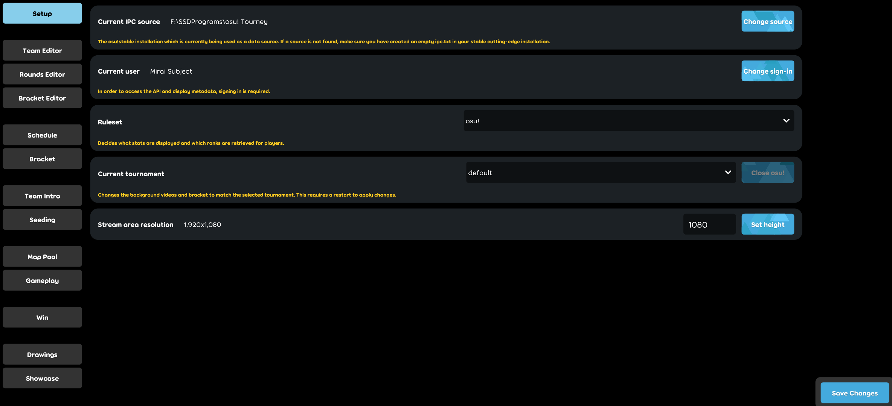

# osu! tournament client

L'**osu! tournament client** est le client officiel qui superpose à [osu!tourney](/wiki/osu!_tournament_client/osu!tourney) des scènes et des informations supplémentaires relatives à un tournoi osu! lors d'une diffusion en direct.

Les utilisateurs rencontrant des problèmes avec le client peuvent [créer un issue sur GitHub](https://github.com/ppy/osu/issues) ou envoyer un courriel à [tournaments@ppy.sh](mailto:tournaments@ppy.sh).

## Configuration

Pour lancer l'osu! tournament client, vous devez spécifier un argument de lancement à l'exécutable [osu!(lazer)](/wiki/Client/Release_stream/Lazer). Pour ce faire, créez un nouveau raccourci sur le bureau et définissez son emplacement à `%LOCALAPPDATA%\osulazer\osu!.exe --tournament`. Ce raccourci spécifique lancera osu!(lazer) en mode client de tournoi.

Puisque l'osu! tournament client n'est qu'une superposition pour osu!tourney, il faudra le configurer aussi. Réglez la sortie dans osu!tourney sur `Cutting Edge (Experimental)` et créez un fichier vide appelé `ipc.txt` dans le dossier d'installation d'osu!tourney. Après cela, suivez le [guide d'installation d'osu!tourney](/wiki/osu!_tournament_client/osu!tourney/Setup).

Ouvrez l'osu! tournament client et vous verrez cet écran de configuration :

- Assurez-vous que la `Source IPC actuelle` correspond à l'emplacement de l'instance osu!tourney que vous allez utiliser.
- Connectez-vous à osu!(lazer) en cliquant sur `Change Login`.
- Définissez le ruleset approprié à l'aide du menu déroulant.
- Changez la hauteur pour qu'elle corresponde à `Height`, définie dans le fichier `tournament.cfg` d'osu!tourney.

## Gestion des tournois

Les configurations de tournois pour [osu!(lazer)](/wiki/Client/Release_stream/Lazer) sont stockées dans `%APPDATA%\osu\tournaments`. Au premier démarrage du client, un répertoire appelé `default` est créé dans ce dossier. Un utilisateur peut maintenir plusieurs configurations de tournois et passer de l'une à l'autre si nécessaire pour obtenir les personnalisations appropriées.

Pour créer une nouvelle configuration de tournoi, créez un nouveau répertoire dans le répertoire `tournaments` avec le nom de votre tournoi.

Dans la configuration d'un tournoi, les actifs nécessaires peuvent être fournis pour afficher des drapeaux, des vidéos et des icônes de mods pour le mappool. Chaque catégorie d'actifs a son propre dossier :

- your-tournament
  - Flags
  - Mods
  - Videos

## Personnalisation

Le client du tournoi osu!(lazer) peut être personnalisé en lui fournissant des drapeaux, des icônes de mods et des fichiers vidéo personnalisés. Ceux-ci s'afficheront dans les scènes respectives selon les besoins.

### Drapeaux

Par défaut, le client du tournoi osu!(lazer) fournit des drapeaux intégrés pour les pays du monde. Ceux-ci peuvent être référencés par leurs [codes pays ISO 3166 Alpha-2](https://www.iso.org/fr/iso-3166-country-codes.html) dans l'éditeur d'équipe.

Pour les drapeaux personnalisés, les fichiers `.jpg` et `.png` sont acceptés. Les images de drapeaux doivent être d'au moins 140x94, en conservant un rapport d'aspect proche de cette spécification pour de meilleurs résultats.

Les drapeaux doivent être placés dans`<your-tournament>\Flags`. Les drapeaux peuvent ensuite être référencés dans l'éditeur d'équipe par leur nom de fichier sans l'extension de fichier.

### Mods

Pour les icônes de mods personnalisés, les fichiers `.jpg` et `.png` sont acceptés. La résolution peut être quelconque et le client l'adaptera au beatmap panel. Pour référence, un beatmap panel à 1920x1080 est de 563x60 pixels.

Les icônes de mods doivent être placées dans `<your-tournament>\Mods`. Les mods peuvent ensuite être référencés par leur nom de fichier sans l'extension dans l'éditeur de tours et dans Seeding Results Editor.

### Vidéos

Des vidéos en boucle peuvent être affichées en arrière-plan de chaque scène.

Remarque : le client décode les fichiers vidéo à l'aide d'un décodage logiciel. Les performances peuvent donc varier en fonction du scénario d'utilisation.

Les fichiers doivent respecter les spécifications suivantes :

- Rapport d'aspect 16:9, par exemple 1280x720 ou 1920x1080
- Extension de fichier `mp4`, `m4v` ou `avi`.
- Codec vidéo : H.264, Codec audio : aucun

Les fichiers vidéo doivent être placés dans le dossier `<your-tournament>\Videos` et des noms spécifiques sont nécessaires pour une fonctionnalité correcte.

| Scène | Fichier(s) |
| :-- | :-- |
| Schedule | `schedule` |
| TeamIntro | `teamintro` |
| Seeding | `seeding` |
| MapPool | `mappool` |
| Gameplay | `gameplay` |
| Win | `teamwin-red`, `teamwin-blue` |
| Drawings | `main` |
| Showcase | `showcase` |
