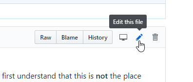

# Interface web de GitHub 

*Cet article est la suite de [la page principale](/wiki/osu!_wiki/Contribution_guide).* Si vous voulez apporter des modifications à plusieurs articles (y compris le téléchargement, la suppression et/ou le déplacement d'images ou de fichiers), veuillez consulter l'autre guide, [GitHub Desktop](/wiki/osu!_wiki/Contribution_guide/GitHub_Desktop).

## Édition

1. Ouvrez l'onglet code de votre fork (vous devriez déjà être sur cet onglet).

2. Naviguez jusqu'au fichier que vous voulez modifier. Les articles sont situés dans le dossier `wiki` et sont organisés par les noms de dossiers qui sont les noms des articles, tandis que les fichiers `.md` sont les traductions.

3. Une fois que vous avez trouvé le bon fichier, cliquez dessus.

4. Cliquez sur l'icône en forme de crayon.

   

5. Vous pouvez maintenant apporter vos modifications. Lorsque vous apportez des modifications, suivez les [Critères de mise en forme des articles](/wiki/Article_styling_criteria) aussi fidèlement que possible.

6. Continuer vers [Sauvegarde et commit](#sauvegarde-et-commit).

### Déplacer des fichiers

*Attention : Ceci n'est **pas recommandé** car vous ne pouvez déplacer qu'un seul fichier à la fois. Cela peut créer de multiples commits "stupides" qui peuvent inciter les réviseurs à [fermer ou bloquer votre pull request](/wiki/osu!_wiki/Contribution_guide/Best_practices#faire-des-modifications) !*

1. Naviguez jusqu'au fichier que vous voulez déplacer et ouvrez-le.

2. Cliquez sur l'icône de crayon.

3. Au-dessus de l'éditeur de texte, il y a un chemin pour l'emplacement du fichier, cliquez sur la zone de texte pour le fichier actuel.

   

4. Pour changer le chemin, appuyez sur `Retour` et répétez jusqu'à ce que la zone de texte recule d'un niveau. Pour remonter le fichier d'un niveau, appuyez sur `/`.

5. Une fois que vous êtes au niveau requis, tapez soit un autre nom de dossier et/ou le nom de la locale (en lettres minuscules) suivi de `.md`.

6. Continuer vers [Sauvegarde et commit](#sauvegarde-et-commit).

### Créer des fichiers

1. Ouvrez l'onglet code de votre fork.
2. Naviguez vers le dossier où vous avez l'intention de créer le fichier.
3. Cliquez sur `Create new file`.
4. Entrez l'emplacement et/ou le nom du fichier de l'article que vous créez. Le chemin doit commencer par `wiki/`, suivi du titre de l'article, puis du nom de la locale (en lettres minuscules) suivi de `.md`. Pour obtenir une liste des paramètres locaux, consultez [Locales dans les critères de style des articles](/wiki/Article_styling_criteria/Formatting#locales).
5. Continuer vers [Sauvegarde et commit](#sauvegarde-et-commit).

### Mettre des fichiers en ligne

1. Ouvrez l'onglet code de votre fork.
2. Naviguez vers le dossier dans lequel vous avez l'intention de télécharger le fichier.
3. Cliquez sur `Upload files`.
4. Sélectionnez les fichiers que vous souhaitez mettre en ligne.
5. Continuer vers [Sauvegarde et commit](#sauvegarde-et-commit).

*Remarque : vous pouvez également mettre en ligne des dossiers*, ce qui peut être utile pour ceux qui souhaitent créer de nouveaux articles localement.

### Deleting files

*Attention : Ceci n'est **pas recommandé** car vous ne pouvez supprimer qu'un seul fichier à la fois. Cela peut créer de multiples commits "stupides" qui peuvent inciter les réviseurs à [fermer ou bloquer votre demande de pull](/wiki/osu!_wiki/Contribution_guide/Best_practices#making-edits) !*

1. Ouvrez l'onglet code de votre fork.
2. Naviguez jusqu'au fichier que vous voulez supprimer et ouvrez-le.
3. Cliquez sur l'icône de la corbeille.
4. Continuer vers [Sauvegarde et commit](#sauvegarde-et-commit).

## Sauvegarde et commit

1. Lorsque vous avez terminé les modifications, faites défiler la page jusqu'au bas de la page. Vous verrez peut-être quelque chose de similaire à ceci :

   

2. **Quoique vous fassiez, ne laissez jamais la zone de texte du titre vide !** Saisissez plutôt le titre de l'article et un bref résumé de toutes les modifications que vous avez apportées **en anglais**.

3. Vous pouvez utiliser la description optionnelle pour être plus détaillé si nécessaire. Un bon commit peut ressembler à quelque chose comme ceci :

   

4. Si c'est la première modification que vous effectuez pour cet article, sélectionnez l'option `Create a new branch for this commit and start a pull request.`. Cela vous permettra d'effectuer des modifications multiples, mais différentes, de l'article à l'avenir (passez à l'étape 5). Sinon, sélectionnez l'option `Commit directory to the {xxxxxx} branch` (et passez à l'étape 6).

5. Nommez cette branche comme vous le souhaitez, assurez-vous simplement de noter le nom que vous avez choisi.

6. Cliquez sur le bouton vert ; il indiquera soit `Propose file change` soit `Commit changes`, selon que vous créez une nouvelle branche ou non.

7. Cela fera deux choses : enregistrer vos modifications dans la branche que vous venez de nommer, puis ouvrir la page de pull request.

   ")

8. Continuez vers [Finition](/wiki/osu!_wiki/Contribution_guide#finitions) pour le dernier élément d'information concernant votre pull request et les changements.
