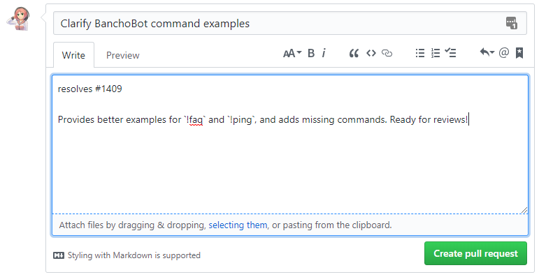

# Руководство по работе с osu! wiki

Спасибо за интерес, проявленный к osu! wiki.

Эта статья адресована тем, кто прежде не работал с GitHub и не участвовал в редактировании osu! wiki. Если такой опыт имеется, дальше можно не читать: пользуйтесь схемой «одна статья (или группа статей на одну тематику) — одна ветка».

Если вам понадобится помощь с этим руководством или osu! wiki, обращайтесь в [дискорд osu!dev](https://discord.gg/ppy), канал `#osu-wiki`.

## Начало работы

### Регистрация

1. [Зарегистрируйтесь](https://github.com/join) на GitHub, если у вас нет аккаунта.
2. [Зайдите в свой аккаунт](https://github.com/login).
3. [Создайте форк](#форк-репозитория).

### Форк репозитория

1. Откройте [репозиторий `osu-wiki`](https://github.com/ppy/osu-wiki).

2. Нажмите на кнопку `Fork`.

   

3. Нажмите на кнопку `Fork` ещё раз, чтобы открыть форк.

4. Если вы всё сделали правильно, то увидите что-то похожее:

   

5. [Синхронизируйте](#синхронизация-форка) свой форк.

### Синхронизация форка

1. Откройте свой форк `osu-wiki`.

2. Над списком файлов можно прочитать, в каком состоянии находится выбранная ветка по сравнению с `ppy:master`. Если там написано «behind» или «ahead and behind», ваша ветка отстаёт.

   ")

   ")

   ")

   ")

3. Отстающая ветка не содержит в себе всех свежих изменений из оригинального репозитория. В этом случае при редактировании osu! wiki вы можете работать с устаревшими статьями и не знать о новых правках.

4. Чтобы узнать, как синхронизировать ветку, загляните в [список проблем при работе с osu! wiki и их решений](/wiki/osu!_wiki/Contribution_guide/Best_practices#Отстающая-ветка-master).

5. После синхронизации ветки можно переходить к редактированию.

## Редактирование статей

Статьи можно править двумя способами:

- Через [веб-интерфейс GitHub](/wiki/osu!_wiki/Contribution_guide/GitHub_Web_Interface), что удобно при работе с одной статьёй.
- В вашем любимом текстовом редакторе, пользуясь [GitHub Desktop](/wiki/osu!_wiki/Contribution_guide/GitHub_Desktop). Этот вариант подходит для нескольких статей или массовых правок.

*Примечание: на самом деле, инструментов для работы с git и GitHub намного больше, но здесь они не упомянуты ради упрощения статьи.*

**После знакомства с одним из способов редактирования переходите к следующему разделу.**

## Публикация изменений

### Создание пулл-реквеста

1. Откройте репозиторий [`ppy/osu-wiki`](https://github.com/ppy/osu-wiki).

2. При наличии ваших недавних коммитов в форк вы увидите жёлтую плашку, как на скриншоте ниже.

   

3. Если плашка видна, нажмите на кнопку `Compare & pull request` и переходите к шагу 8. Если нет — на кнопку `New pull request` (следующий шаг).

4. Если перед вами только две кнопки, как на скриншоте, выберите `compare across forks`.

   

5. В списке `head fork` выберите ваш форк (второй по списку).

   

6. В списке `compare` выберите ветку, которую вы хотите отправить в пулл-реквесте (они отсортированы по алфавиту).

   

7. Нажмите на кнопку `Create pull request`.

8. В заголовке кратко опишите суть пулл-реквеста: что вы дописываете или исправляете. Для простоты можно указать только название статьи.

   Если это перевод, вставьте перед заголовком пулл-реквеста название языка, на который вы переводите. Например, `[RU] IRC` означает, что вы обновляете (или создаёте) перевод [статьи про IRC](/wiki/Internet_Relay_Chat) на русский язык.

9. Напишите описание к пулл-реквесту. В него можно добавить всё, что вы хотите донести до ревьюеров, например, «Needs formatting check» или «Проверьте грамматику, пожалуйста». Кроме того, можно указать баги, которые этот пулл-реквест закроет, например, «resolves #1» (см. справку GitHub [«Closing issues using keywords»](https://help.github.com/articles/closing-issues-using-keywords/)).

10. Когда всё будет готово, нажмите на кнопку `Create pull request`.

   

11. О том, что будет дальше, можно узнать в разделах про [ревью](#ревью) и [слияние изменений](#слияние-изменений).

### Ревью

Сразу после создания пулл-реквеста его смогут увидеть и прокомментировать другие люди, указав на возможные недочёты. Пулл-реквест, где долгое время ничего не происходит, могут закрыть, поэтому ваша задача — **следить за комментариями, отвечать на них и исправлять найденные ошибки.** Если вы хотите, чтобы вашу работу проверили, напишите в [дискорд osu!dev](https://discord.gg/ppy) на канал `#osu-wiki` или в комментарии на GitHub.

### Слияние изменений

Когда все проблемы, найденные в ходе ревью, будут исправлены, и кто-нибудь из ревьюеров утвердит пулл-реквест, его можно будет влить в основной репозиторий. Об этом можно попросить в комментариях на GitHub или в [дискорде osu!dev](https://discord.gg/ppy) на канале `#osu-wiki`. После того, как ваши изменения влили, через некоторое время (максимум — 5 часов) они появятся на osu! wiki.
