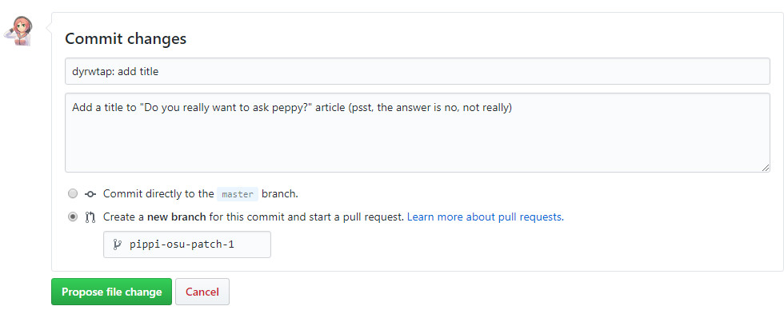

# Interface Web GitHub

*Cet article est la continuité de la page principale.* Si vous envisagez de modifier plusieurs articles (y compris le téléchargement, la suppression et/ou le déplacement d'images ou de fichiers), veuillez consulter l'autre guide, [GitHub Desktop](/wiki/owcg/GitHub_Desktop).

## Édition

1. Ouvrez l'onglet de code sur votre fork (vous devriez déjà être sur cet onglet).

2. Accédez au fichier que vous souhaitez modifier. Les articles sont situés dans le dossier `wiki` et sont organisés par les noms de dossier qui sont les noms d'article, tandis que les fichiers `.md` sont les traductions.

3. Une fois que vous avez trouvé le bon fichier, cliquez dessus.

4. Cliquez sur l'icône du crayon.

5. Vous pouvez maintenant apporter vos modifications. Lorsque vous effectuez des modifications, essayez de suivre les [Critères de style pour les articles](/wiki/ASC) aussi fidèlement que possible.

6. Continuez à [Saving and committing](#saving-and-committing).

### Déplacement de fichiers

- Attention: Ceci est **non recommandé** car vous ne pouvez déplacer qu'un fichier à la fois! Cela peut créer plusieurs commits "stupides" qui peuvent amener les relecteurs à fermer ou à rejeter votre pull request! *

1. Naviguez jusqu'au fichier que vous souhaitez déplacer et ouvrez-le.

2. Cliquez sur l'icône du crayon.

3. Au-dessus de l'éditeur de texte, il y a un chemin pour l'emplacement du fichier, cliquez sur la zone de texte du fichier actuel.

4. Pour changer le chemin, appuyez sur `Backspace` et répétez jusqu'à ce que la zone de texte recule d'un niveau. Pour monter le fichier d’un niveau à l’autre, appuyez sur `/`.

5. Une fois que vous avez atteint le niveau requis, saisissez un autre nom de dossier et/ou le nom de la région (en minuscules) suivi de `.md`.

6. Continuez à [Saving and committing](#saving-and-committing).

### Création de fichiers

1. Ouvrez l'onglet de code sur votre fork.

2. Accédez au dossier dans lequel les fichiers doivent être téléchargés.

3. Cliquez sur `Create new file`.

4. Entrez l'emplacement et/ou le nom de fichier de l'article que vous créez. Le chemin doit commencer par `wiki/`, suivi du titre de l'article, suivi du nom de l'environnement local (en minuscules) suivi de `.md`. ou une liste de lieux, voir le [Paramètres régionaux dans les critères de style d'article](/wiki/ASC#locales).

5. Continuez à [Saving and committing](#saving-and-committing).

### Téléchargement de fichiers

1. Ouvrez l'onglet de code sur votre fork.

2. Accédez au dossier dans lequel les fichiers doivent être téléchargés.

3. Cliquez sur `Upload files`.

4. Sélectionnez les fichiers que vous souhaitez télécharger.

5. Continuez à [Saving and committing](#saving-and-committing).

*Remarque: vous pouvez également télécharger des dossiers.* Cela peut être utile pour ceux qui souhaitent créer de nouveaux articles localement.

### Suppression de fichiers

*Attention: Ceci est **non recommandé** car vous ne pouvez supprimer qu'un fichier à la fois! Cela peut créer plusieurs commits "stupides" qui peuvent amener les relecteurs à fermer ou à rejeter votre pull request !*

1. Ouvrez l'onglet de code sur votre fork.

1. Naviguez jusqu'au fichier que vous souhaitez supprimer et ouvrez-le.

3. Cliquez sur l'icône de la corbeille.

4. Continuez à [Saving and committing](#saving-and-committing).

## Saving and committing

1. Lorsque vous avez terminé vos modifications, faites défiler vers le bas de la page. Vous pouvez voir quelque chose de semblable à ceci:

2. **Quoi que vous fassiez, ne laissez jamais la zone de texte du titre vide!** A la place, entrez le titre de l'article et un court résumé de toutes les modifications que vous avez apportées **en anglais**.

3. Vous pouvez utiliser la description facultative s'il vous est nécessaire d'ajouter plus de détails. Un bon commit peut ressembler à quelque chose comme ça :

4. S'il s'agit de la première modification que vous effectuez pour cet article, sélectionnez l'option `Create a new branch for this commit and start a pull request.`. Cela vous permettra d’apporter à l’avenir des modifications d’articles multiples, mais différentes (passez à l’étape 5). Sinon, sélectionnez `Commit directory to the {xxxxxx} branch.` (et passez à l'étape 6).

5. Nommez cette branche comme bon vous semble, assurez-vous de bien noter le nom que vous avez choisi.

6. Cliquez sur le bouton vert. il va proposer soit `Propose file change` ou `Commit changes`, cela dépend si vous créez une nouvelle branche ou non.

7. Cela fera deux choses : sauvegardez vos modifications dans la branche que vous venez de nommer et cela ouvrira la page de demande de tirage.

")

8. Continuez à [Finition](#finition).

## Finition

Vous pouvez maintenant revenir au [Guide de contribution du osu! wiki](/wiki/owcg#finition) pour la dernière information concernant votre demande et vos modifications.
