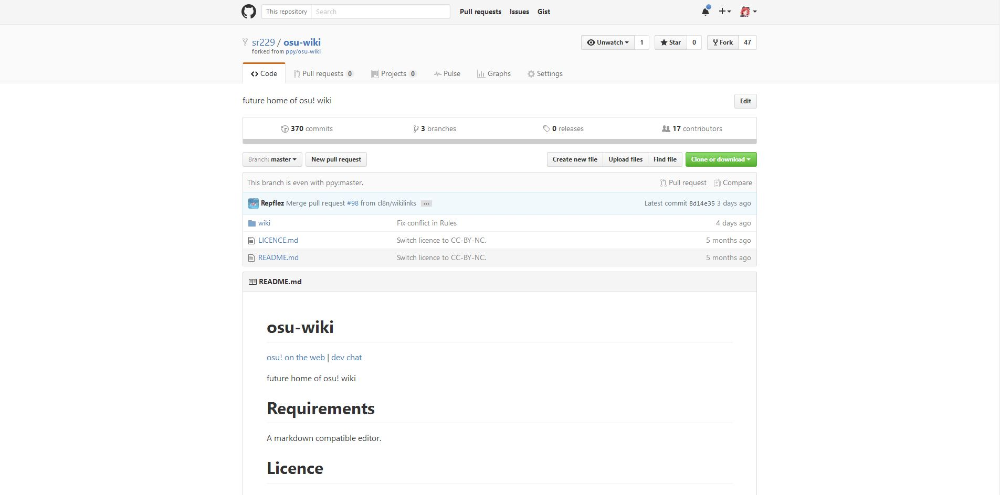
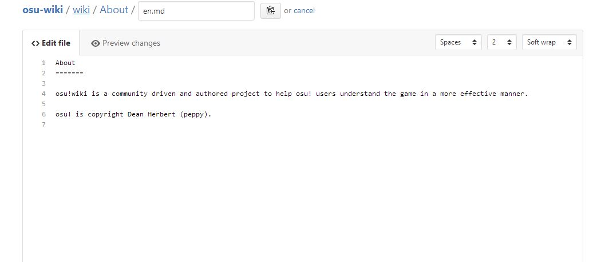
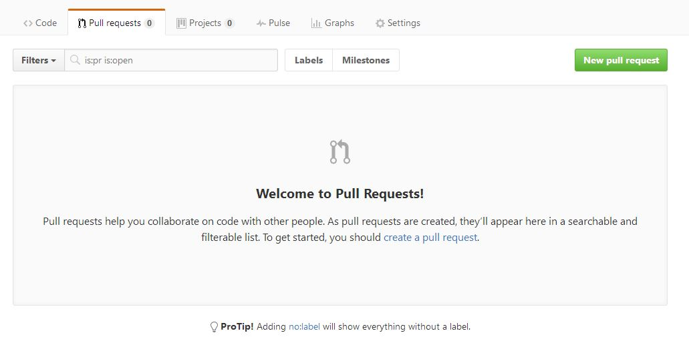

怎样为 osu!wiki 做贡献
==================

感谢您对维护 osu!wiki 感兴趣! 如您所见, 所有wiki都移动到了 [GitHub](https://github.com/ppy/osu-wiki).

下面的教程将指导您为 osu!wiki 做出新的贡献,望您牢记.

## 预先准备

要为 osu!wiki 贡献您需要满足以下条件:

- 一个 [GitHub 账户](https://help.github.com/articles/signing-up-for-a-new-github-account/).
- [Markdown](https://github.com/adam-p/markdown-here/wiki/Markdown-Cheatsheet) 知识, 特别是 [Github-Flavoured Markdown(GFM)](https://help.github.com/articles/getting-started-with-writing-and-formatting-on-github/ "GitHub Help on Writing on GitHub")(GitHub风格的Markdown).

特别地, 如果您想在本地做更新:

- 一个带 Markdown 文本高亮的编辑器.
  - 使用微软的 [Visual Studio Code](https://code.visualstudio.com) 或者 Github的 [Atom](https://atom.io).
  - 任何文本编辑器都可以,如果您不需要高亮.
- 一个支持 **GFM** 高亮的预览器. 
  - 使用 [Shiba](https://github.com/rhysd/Shiba), 或者 Visual Studio Code/Atom's 内置的 GFM previewers.
- 一点 VCS (Version control system)(版本控制系统) 的知识, 尤其是 [Git](https://git-scm.com/ "Git").

## Forking
 
 想要为repository(下称仓库)做更改, 您需要先创建一个当前仓库的copy(下称拷贝). 这被称作 "forking".
 
 前往 [osu!wiki 仓库](https://github.com/ppy/osu-wiki).
 
 您应该会看到类似以下的内容
 


点击 "Fork" 按钮, 它在页面的右上方. 它会将您重定向到您fork的仓库.


现在选择您的帐号然后Github将带您前往您fork的仓库.(有些时候不需要选择)

最后,您将看到这个页面.



恭喜! 您已成功创建了 osu!wiki 仓库的一份拷贝! 您现在可以更改了.

## 做改动 

### 使用GitHub网页编辑器

如果您不想将您的拷贝复制到您的 PC 上, GitHub 提供了网页编辑器.

要编辑一个页面, go to the folder of that page and select the language of that article. From here, you should see something like this.

_Note: Each article is grouped into folders where they contain markdown files arranged by language and their media. All article pages inside these folders must use the two letter language codes. To know which language code to use, see the [List of ISO 639-1 codes](https://en.wikipedia.org/wiki/List_of_ISO_639-1_codes) following the `639-1` column. Please follow this format when creating a new article._                  


Click on the pencil icon to edit; this should redirect you to the web editor.



If you want to preview your changes, click the "Preview Changes" tab. To go back and edit, click the "Edit File" tab.

After making your changes, scroll down and fill the following fields to explain your edit(s) to other contributors.


_**Note: Your commit message(s) must thoroughly explain your changes, otherwise, they may not get merged!**_

You would be given an option where to save your edits.

- **"Commit Directly to the ``xyz`` branch"** 
  - This will commit the changes through your branch directly.

- **"Create a New Branch"** 
  - Automatically creates a branch for your edits. A commit and a branch with a default name (normally, it would be called ``username : patch-1``) would be created.

A more detailed explanation about this can be found [here]( https://guides.github.com/introduction/flow/).

Pick an option and click "Commit Changes".

### Through your Local Machine

GitHub under the hood is a Git Service. You can clone your fork to your PC and make changes there.

if you have Git installed, enter this in your Command Line Interface (CLI):
```prolog
git clone https://github.com/<your github username (ie. peppy)>/osu-wiki 
```
*Note: If you don't have Git installed, you can go to [their website](https://git-scm.com/) to download Git and [set it up](https://help.github.com/articles/set-up-git/).*

and this should clone your fork into the folder you specified. You can now proceed to make your changes.

After making your changes locally, you will need to commit this on your local copy.

This can be done by entering this to the Command Line Interface (CLI): 
```prolog
git add .
git commit -m "<explain your changes here>"
```
However, some editors (ie. Visual Studio Code) may provide a Git interface.

After committing your changes, you need to push the commits to GitHub so everyone can see it. To do this, enter the following to your Command Line Interface:

```prolog
git push origin <branch>
```
This should prompt you to enter your GitHub login credentials. After you enter them, this should push your commits to GitHub.

_Note: Always check if your copy is synced with your remote. enter ``git status`` to check for any uncommitted changes and the status of your local repositry versus your remote repository._

_Note: However, If your authentication details were saved in Git already, no prompt will appear and will proceed directly to push. This can be done by [caching your Git credentials](https://help.github.com/articles/caching-your-github-password-in-git/)._

## Pull Requests

After pushing your commits, you must make a "Pull Request"(abbreviated as "PR"). This lets us know that your commits are ready to be reviewed.

Go to the "Pull Requests" tab.


This would lead you to the pull requests page.



This is the Pull Request Page. Now click on "New pull request"


We want to compare ``ppy:master`` against your branch.

From here, select the branch that contains your commits besides your "head fork".


_However, if you made changes in your master branch, the changes will be shown without the need to change anything in the head fork options._

Now after viewing your changes, click "Create Pull Request" and fill it with the following details:

- **Title** : The summary of the changes you have made
  - Note: it is really important to have a meaningful and clear title, otherwise it will cause confusion

- **Leave a Comment** : The details of the changes you have made


Click on the "Create pull request" button and wait for a reviewer to check and, possibly, merge your changes to the official branch.

**Your commit messages should thoroughly explain your changes. Otherwise, the pull request may not be merged to the official branch!**

## FAQ

###  Why is the old osu!wiki not staying?

Due to abysmal performance, the old wiki is getting deprecated
as stated [here](https://github.com/ppy/osu-wiki/issues/69).

###  How would this differ from the old wiki?

- We use GitHub for collaboration. You can make mass changes easily and efficiently, and you can delay your changes for as long as you like.
- Unlike the old osu!wiki, changes has to be made via pull requests which are then reviewed by staff or someone with write permissions. This adds a layer of security against spammers and vandals.
- Linking is done manually, and must be done using static linking.
- **No Templates**. You must duplicate the template and paste it accordingly to the article you are editing.
- Addition, deletion, and renaming of media is easier and requires no special wiki function. However, this has to undergo the pull request protocol.
- Tables are supported by a bare-minimum with GFM (without extensions), unlike MediaWiki. However, this does mean we will need to code some tables with HTML for extreme cases.
- Markdown is sensitive. Using the wrong capitalization in links can break them (i.e. links and images).

### Can we use HTML?

We avoid the use of HTML with rare exceptions (usually for complicated tables).


## Conclusion
We hope this briefs you on how to contribute to the new osu!wiki. If you have any questions,
you can inquire at the [osu!dev Discord Server](https://discord.gg/ppy).
